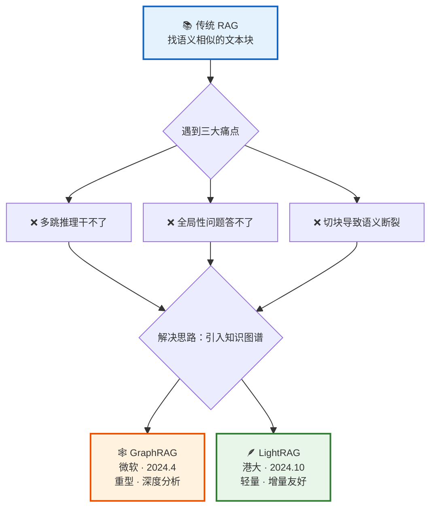
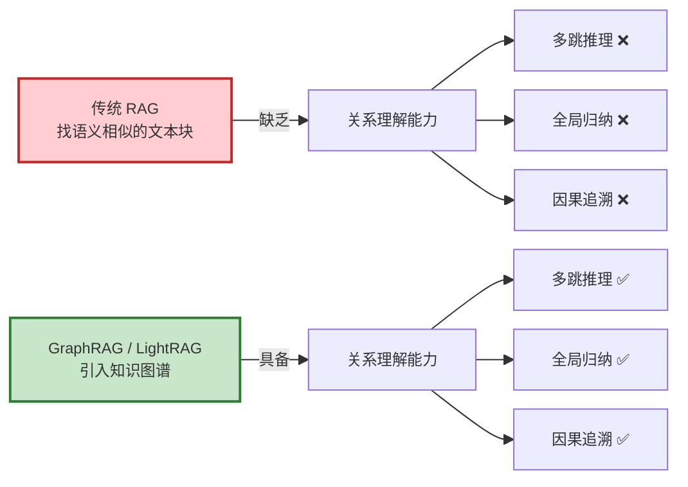
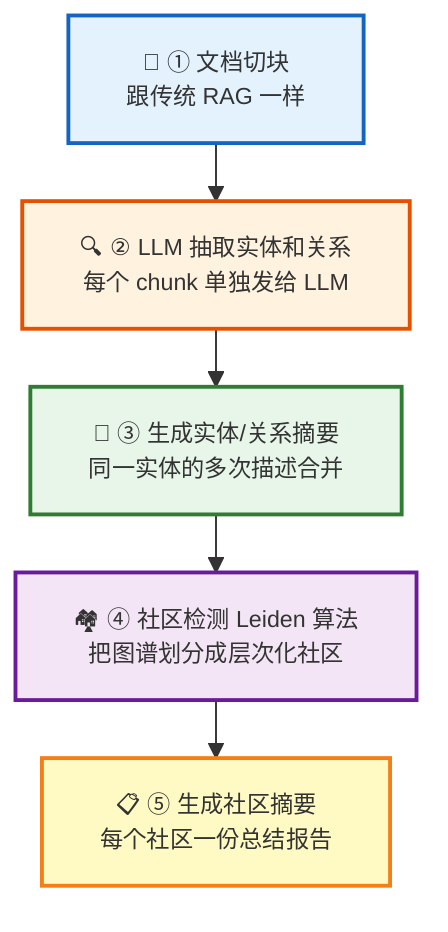
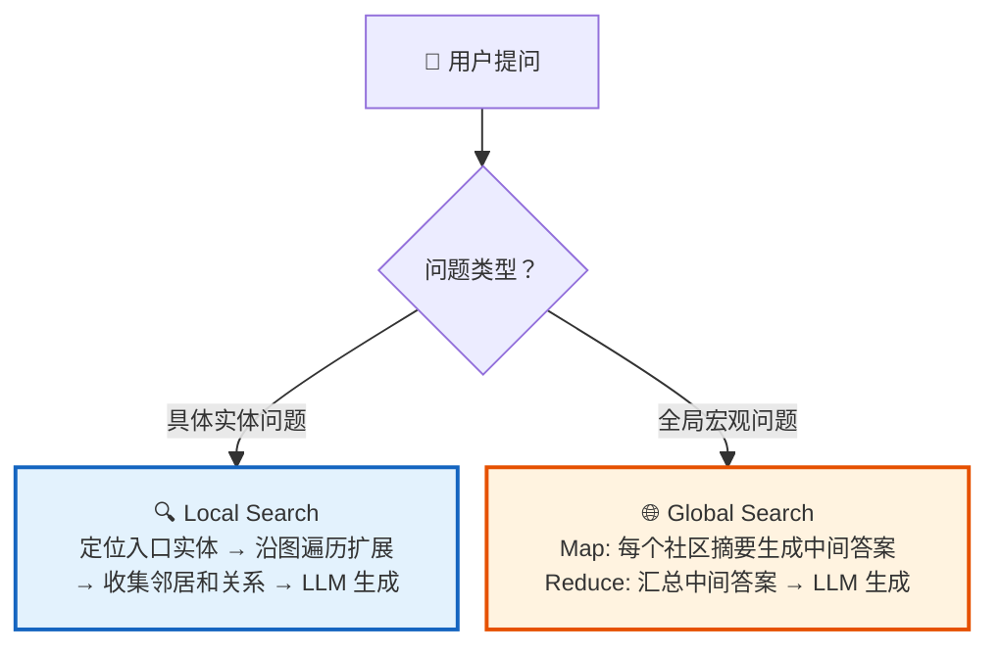
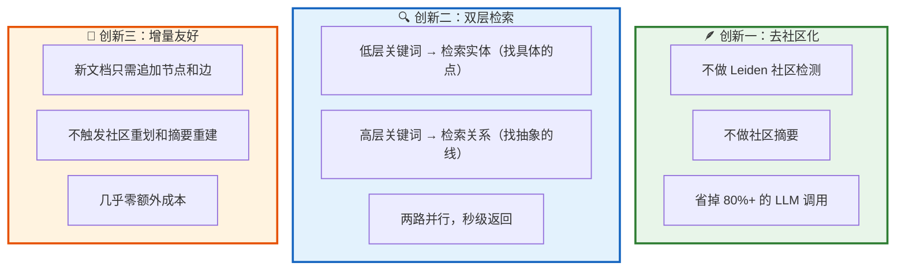
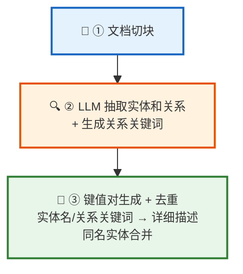
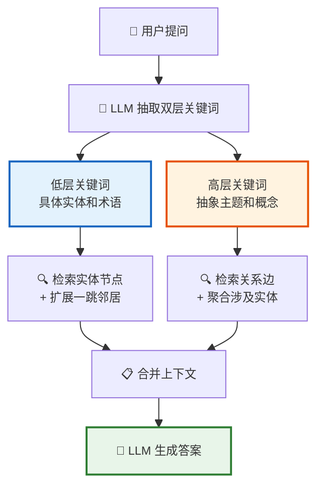
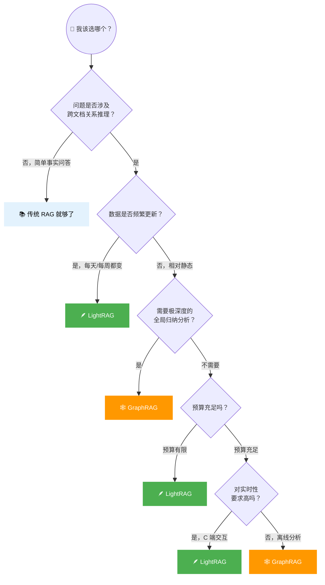
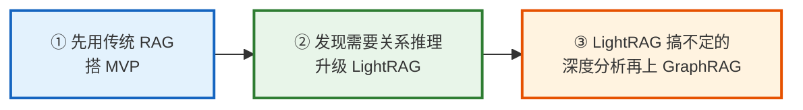
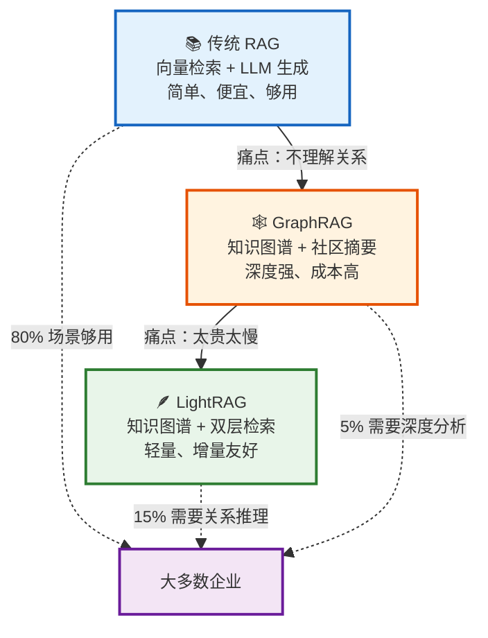

# 🕸️ GraphRAG & LightRAG 进阶学习指南

**作者**: RJ.Wang
**邮箱**: wangrenjun@gmail.com
**创建时间**: 2026-04-24
**内容来源**: 小林coding 公众号文章整理
**前置知识**: 建议先阅读 [RAG & Fine-tuning 学习指南](RAG_and_Fine-tuning_学习指南.md)

---

## 📖 前言：传统 RAG 够用吗？

上一篇学习指南讲了传统 RAG 的完整流程：文档切块 → 向量化 → 入库 → 检索 → 生成。这套方案在 Demo 场景下跑得很好，但一旦拿到企业的复杂场景，就会撞上几堵硬墙。

GraphRAG 和 LightRAG 就是为了绕过这几堵墙而出现的。



---

## 第一部分：传统 RAG 的三大痛点

### 痛点 ① 多跳推理干不了

有些问题需要跨多个文档做链式推理：A → B → C。

比如："哪些欧洲供应商在过去一年的安全审计中没通过，而且还在处理个人隐私数据？"

这个问题需要同时关联三份文档：供应商档案、审计报告、合同文档。传统 RAG 只能分别检索到一些相关的 chunk，但没有任何机制把三个集合做"交集"。

### 痛点 ② 全局性问题答不了

"这本小说的主题思想是什么？""这份年报里公司战略发生了哪些变化？"

这类问题的答案不在某一个 chunk 里，需要通读所有文档归纳总结。但传统 RAG 只会找 Top-K 个最像的 chunk，哪个 chunk 会写"本书主题思想是 XXX"？几乎没有。

### 痛点 ③ 切块导致语义断裂

文档切块会把完整的因果关系拦腰斩断。比如原文写"卡托普利属于 ACEI 类药物，但严重肾功能不全者禁用"，切块后可能分散在两个 chunk 里，大模型拿到碎片化事实就容易搞混因果关系。

### 根本原因

传统 RAG 做的是"找相似文本"，但企业真正需要的是"理解实体关系"。



---

## 第二部分：什么是 GraphRAG？

### 2.1 一句话理解

GraphRAG = 用 LLM 把文档"读成一张知识图谱"，然后基于这张图谱来做检索和回答。

传统 RAG 存的是一堆独立的文本块，GraphRAG 存的是一张实体和关系组成的网络：

```
传统 RAG：
  chunk 1: "张三在2025年创立了A公司..."  （独立文本块）
  chunk 2: "李四是A公司的CTO..."         （独立文本块）
  → 块和块之间没有任何联系

GraphRAG：
  [张三] --创立--> [A公司] --CTO是--> [李四]
  [A公司] --主营--> [自动驾驶]
  → 实体和关系形成一张网络
```

### 2.2 索引阶段：5 步把文档变成知识图谱



**社区是什么？** 图里那些互相抱团、关系特别密切的一群节点。比如在《三国演义》里，刘关张是一个小社区，曹操集团是一个社区，诸葛亮周边又是一个社区。

社区还有层次：最粗的一层可能是"蜀汉集团""曹魏集团""东吴集团"，再往下细分出"刘关张小团体""五虎上将"等。用户问得越宏观，用越高层的社区；问得越具体，用越低层的社区。

### 2.3 查询阶段：两种搜索模式



### 2.4 GraphRAG 的四大难点

| 难点 | 问题 | 影响 |
|:---|:---|:---|
| 💸 索引成本高 | Token 消耗是传统 RAG 的几十倍 | 100 万 token 约 $20-50 |
| 🔀 实体消歧难 | 同一实体被抽成多个节点 | 关系碎片化，检索召回不全 |
| 🐢 查询延迟高 | Global Search 遍历大量社区 | 端到端 10s~1min |
| 🔄 增量更新难 | 牵一发而动全身 | 社区重划 → 摘要重建 → 索引重算 |

> 🍳 比喻：GraphRAG 像一个很勤快的图书管理员，在你进图书馆之前已经把每个主题区都写好了概览海报。查得快，但维护贵。

---

## 第三部分：什么是 LightRAG？

### 3.1 一句话理解

LightRAG = GraphRAG 的轻量化替代方案。保留知识图谱的关系理解能力，但去掉社区检测和社区摘要，用双层检索替代。

### 3.2 三大核心创新



### 3.3 索引阶段：只有 3 步（对比 GraphRAG 的 5 步）



对比 GraphRAG 省掉了什么：

| 步骤 | GraphRAG | LightRAG |
|:---|:---:|:---:|
| 实体抽取 | ✅ | ✅ |
| 关系抽取 | ✅ | ✅ |
| 实体/关系摘要 | ✅（重） | ✅（轻） |
| 社区检测 Leiden | ✅ | ❌ |
| 社区摘要 | ✅ | ❌ |

### 3.4 查询阶段：双层检索



举个例子：

```
查询："国际贸易如何影响全球经济稳定？"

高层关键词：国际贸易、全球经济稳定、经济影响
  → 去向量库检索相关的"关系边"

低层关键词：贸易协定、关税、货币汇率、进口、出口
  → 去向量库检索相关的"实体节点"

两路结果合并 → 组装上下文 → LLM 生成答案
```

LightRAG 提供四种查询模式：

| 模式 | 做什么 | 适合场景 |
|:---|:---|:---|
| Naive | 纯向量检索（传统 RAG） | 简单事实问答 |
| Local | 只用低层检索（找实体） | 具体实体问题 |
| Global | 只用高层检索（找关系） | 主题归纳问题 |
| Hybrid | 双层同时用（默认推荐） | 复杂综合问题 |

### 3.5 增量更新：真正的轻量友好

```
新文档来了
  ↓ 切块 + 抽实体和关系（只处理新文档）
  ↓ 同名实体？合并描述。新实体？加新节点。
  ↓ 新关系追加到图上
  ↓ 新描述向量化，追加到向量库
  ↓ 完成。不用重算社区，不用重建摘要。
```

> 🪶 比喻：LightRAG 像一个聪明的助手，你告诉他你想了解什么，他现场帮你把相关的书和书之间的关系梳理出来。查得灵活，维护便宜。

---

## 第四部分：GraphRAG vs LightRAG 全面对比

### 4.1 核心对比表

| 维度 | 🕸️ GraphRAG | 🪶 LightRAG |
|:---|:---|:---|
| 发布时间 | 2024.4（微软） | 2024.10（港大） |
| 核心创新 | 社区检测 + 社区摘要 | 双层检索 + 增量友好 |
| 索引步骤 | 5 步（含社区） | 3 步（无社区） |
| 索引成本（100 万 token） | $20-50 | ~$0.15 |
| 单次查询延迟 | 10s~1min（Global） | 1~3s |
| 增量更新 | 难（级联重建） | 易（直接追加） |
| 全局深度洞察 | 强（社区摘要） | 一般（临场组装） |
| 实体消歧 | 多层策略，精度高 | 朴素名称匹配 |
| 适合场景 | 深度分析、静态知识库 | 实时更新、成本敏感 |

### 4.2 成本对比（真刀真枪的数字）

| 指标 | GraphRAG | LightRAG |
|:---|:---|:---|
| 索引 100 万 token | $20-50 | ~$0.15 |
| 单次查询 Token 消耗 | ~13,000 | 100~1,000 |
| 单次查询 API 调用 | 几百次 | 几次 |
| 增量一次更新 | 可能触发社区重建 | 几乎零额外成本 |

Token 消耗降低 99%，这是 LightRAG 最吸引人的数字。

---

## 第五部分：怎么选？

### 5.1 选型决策树



### 5.2 按数据规模选

| 数据规模 | 推荐方案 |
|:---|:---|
| < 10 万 token | 传统 RAG（没必要上图） |
| 10 万 ~ 500 万 token | LightRAG 最佳 |
| 500 万 ~ 5000 万 token | 看业务侧重，两者都可以 |
| > 5000 万 token | GraphRAG 更合适（规模越大，社区摘要价值越大） |

### 5.3 务实建议



不要一上来就选重型方案。先跑 MVP 看用户到底在问什么类型的问题，再按需升级。

---

## 第六部分：RAG 技术演进全景



RAG 技术的发展，本质上是在"精度""成本""速度""维护"之间不断做权衡。没有银弹，只有最适合你业务场景的方案。

---

## 📚 参考来源

- [字节二面：别光吹RAG，说说GraphRAG的多跳推理](https://mp.weixin.qq.com/s/f8M0MWpdcH4AeauZrdxgqw) — 小林coding，2026-04-22
- [鹅厂面试官：什么是 RAG？工作流程是怎样的？](https://mp.weixin.qq.com/s/KnNx_ewIeJ_CZhfs6HtnTA) — 小林coding，2026-04-20
- 微软 GraphRAG 论文：*From Local to Global: A Graph RAG Approach to Query-Focused Summarization*（2024.4）
- LightRAG 论文：*LightRAG: Simple and Fast Retrieval-Augmented Generation*（2024.10，EMNLP 2025）

> 内容基于以上文章整理，已重新组织结构并用通俗语言改写，适合初学者阅读。
