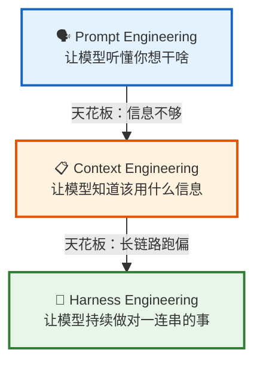
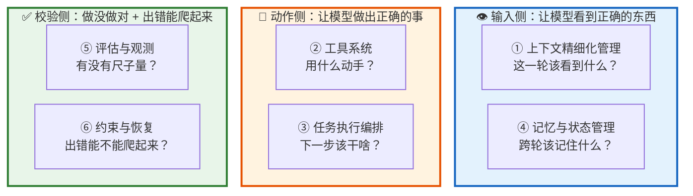
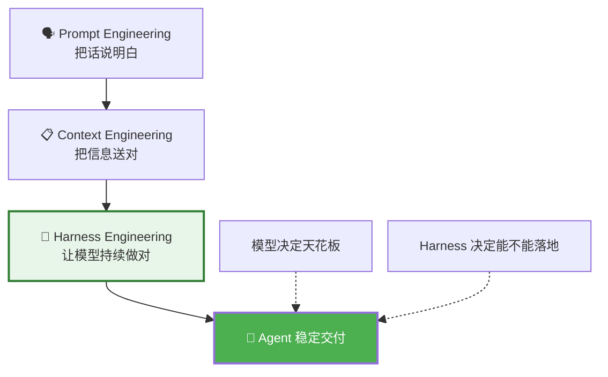

# 🐴 Harness Engineering 学习指南

**作者**: RJ.Wang
**邮箱**: wangrenjun@gmail.com
**创建时间**: 2026-04-24
**内容来源**: 小林coding 公众号文章整理
**前置知识**: 建议先阅读 [RAG & Fine-tuning 学习指南](RAG_and_Fine-tuning_学习指南.md)

---

## 📖 前言：AI 工程的重心换了三次

过去两年，AI 工程的核心问题悄悄换了三次。每一次都是上一次撞到天花板之后，被逼出来的。



这三者不是替代关系，而是层层包含：

```
Harness（整个运行环境）
  └── Context（输入环境）
        └── Prompt（指令）
```

---

## 第一部分：三个阶段，各解决什么问题？

### 1.1 Prompt Engineering — 把话说明白

模型本质上是一个对上下文极度敏感的概率生成器。你给它什么样的输入，它就沿着那个方向生成。

```
❌ "加个排序" → 给你一段不知道放哪的代码片段
✅ "请帮我对 users 列表按年龄从大到小排序，保留原有逻辑，输出完整代码" → 靠谱
```

Prompt Engineering 的本质：不是在"命令"模型，而是在塑造它的概率空间。

适用场景：短链路任务（聊天、翻译、写文案），一句问一句答就完事。

天花板：提示词写得再漂亮，也替代不了模型不知道的知识。

### 1.2 Context Engineering — 把信息送对

Agent 时代，模型不再只是"回答问题"，而是要进到真实环境里"干活"。它需要的不只是一句好的提示词，而是一整套任务环境：当前文档、历史对话、工具返回结果、任务状态、安全约束……

Context Engineering 的核心：模型未必知道，所以系统必须在合适的时机，把正确的信息送进去。

三个关键步骤：


关键洞察：上下文优化的本质不是"给得越多越好"，而是"按需给、分层给、在正确的时机给"。

天花板：信息都给对了，模型在长链路任务里还是会跑偏。

### 1.3 Harness Engineering — 让模型持续做对

当模型从"回答问题"走向"连续执行任务"，一个全新的问题出现了：谁来监督它？谁来在它跑偏的时候把它拉回来？

```
Harness = 马具 / 缰绳

马（模型）有强大的力量，但没有缰绳就是失控的。
Harness 的作用 = 让这股力量为你所用。
```

核心公式：

```
Agent = Model + Harness
Harness = Agent − Model
```

在一个 Agent 系统里，除了模型本身之外，几乎所有决定它能否稳定交付的东西，都属于 Harness。

### 1.4 三者对比

| | 🗣️ Prompt | 📋 Context | 🐴 Harness |
|:---|:---|:---|:---|
| 解决什么 | 让模型听懂 | 让模型知道 | 让模型做对 |
| 优化对象 | 指令表达 | 输入环境 | 整个运行系统 |
| 关系 | 最内层 | 中间层 | 最外层（包含前两者） |
| 适用场景 | 单轮对话 | 需要外部知识 | 长链路、可执行、低容错 |

---

## 第二部分：Harness 里面装了什么？

一个成熟的 Harness 可以拆成六层，分三组：



### 六层速览

| 层 | 核心问题 | 做什么 |
|:---|:---|:---|
| ① 上下文精细化 | 这一轮该看到什么？ | 动态筛选信息，不一次塞满 |
| ② 工具系统 | 用什么动手？ | 接工具（API/CLI），控制调用时机 |
| ③ 执行编排 | 下一步该干啥？ | 给模型一条明确的工作轨道（ReAct 等） |
| ④ 记忆与状态 | 跨轮该记住什么？ | 状态外化到文件，分层管理生命周期 |
| ⑤ 评估与观测 | 做得好不好？ | Eval 集 + Trace 日志 |
| ⑥ 约束与恢复 | 出错能爬起来吗？ | 硬约束 + 自动校验 + 失败预案 |

### Mitchell Hashimoto 的复利效应

Harness Engineering 这个词最早由 HashiCorp 创始人 Mitchell Hashimoto 在 2026 年 2 月提出，核心理念：

> 每次 Agent 犯错，就花点时间把修复沉淀到环境里，让它永远不会再犯同样的错误。

每一次犯错 → 环境变强一点 → 下次更少犯错 → 改进速度更快。这是复利。

修复落到哪一层？

```
Agent 总漏掉某个信息     → 改第 ① 层
Agent 总用错工具         → 改第 ② 层
Agent 步骤乱            → 改第 ③ 层
Agent 跨天记不住进度     → 改第 ④ 层
没法判断做得好不好       → 搭第 ⑤ 层
Agent 一失败就崩溃       → 强化第 ⑥ 层
```

---

## 第三部分：大厂踩过的五个坑

### 坑 ① Agent 跑久了越走越偏

现象：Agent 一开始表现好，跑着跑着开始"忘"目标、重复劳动、偏离主线。Cognition（Devin 团队）发现模型还会出现"上下文焦虑"——觉得窗口快满了就急着收尾，跳过验证步骤。

解法（Anthropic）：Context Reset — 直接把旧的上下文窗口整个丢掉，换一个干净的接手。状态全部外化到文件系统（进度日志 + 启动脚本 + git history），新窗口从文件恢复。

> 🐴 原则一：重启胜过修补。状态沉到文件里，Agent 随时可以在干净的窗口里接力继续。

### 坑 ② Agent 自评总偏乐观

现象：让 Agent 自己给自己打分，它永远觉得自己干得不错。

解法（Anthropic）：三角分工 — Planner（规划）、Generator（生成）、Evaluator（验收）必须分离。验收方必须能摸到真实环境（真的去操作页面、跑测试），不能只看代码。

> 🐴 原则二：生产和验收必须分离，验收方必须能摸到真实世界。

### 坑 ③ Agent 反复失败，工程师该干啥？

现象：Agent 犯错时，本能反应是调提示词或换更强的模型。

解法（OpenAI Codex）：不是催模型更努力，而是改环境。给 Agent 接上 lint、单测、运行环境，让它自己写完自己跑、看见 bug 自己改。工程师的价值不再是"写代码"，而是"设计 Agent 的运行环境"。

> 🐴 原则三：Agent 反复失败时，别问模型能不能更努力，要问环境还缺什么。

### 坑 ④ 规范文件越写越长，Agent 反而更糊涂

现象：OpenAI 早期把所有规范塞进一个巨大的 AGENTS.md，结果 Agent 注意力被稀释，表现更差。

解法：把"百科全书"改成"目录页"。主文件只保留约 100 行核心索引，详细内容拆到子文档，Agent 按需加载。

> 🐴 原则四：规则文件宁缺毋滥，给模型看的东西少即是多。

### 坑 ⑤ Agent 代码越堆越烂

现象：Agent 会疯狂模仿仓库里已有的代码模式，好的坏的都复制。OpenAI 称之为"AI slop"（AI 代码泔水）。

解法：把工程师的经验写成"Golden Principles"沉进仓库，让后台 Agent 定期扫描、自动开修复 PR。技术债从"每周五集中清扫"变成"每天自动偿还"。

> 🐴 原则五：技术债天天还，用 Agent 治 Agent。

### 五条原则口诀

```
重启胜过修补，生产验收分家，
与其催模型不如改环境，
规则宁缺毋滥，技术债天天还。
```

---

## 第四部分：一个反直觉的发现

> Agent 对"老技术"反而掌握得最好。

OpenAI 在 Codex 项目中发现：越老、文档越齐全、在开源社区沉淀越久的技术，Agent 越容易用对。原因很简单——训练数据里相关的代码示例多如牛毛。

而昨天才出的新框架，AI 只看过零星几篇文档，很容易张冠李戴。

实际启发：如果你要做一个让 Agent 跑得稳的项目，选技术栈不要追新。

---

## 第五部分：跟你的学习项目有什么关系？

你在 Kiro IDE 里做的这些事情，本质上就是在做 Harness Engineering：

| 你做的事 | 对应 Harness 的哪一层 |
|:---|:---|
| `.kiro/steering/` 规范文件 | ① 上下文精细化 + ④ 长期记忆 |
| Agent Hooks（文件保存时自动 lint 等） | ⑥ 约束与恢复 |
| 学习指南里的批注（Q&A） | ⑤ 评估与观测（自我校准） |
| Mermaid 图的 init 配置统一 | ④ 状态管理（规范沉淀） |
| README 里的定位说明 | ① 上下文（给读者/Agent 明确边界） |

---

## 第六部分：总结



> AI 落地的核心挑战，正在从"让模型看起来更聪明"，转向"让模型在真实世界里稳定地工作"。

模型决定了 Agent 的天花板，但 Harness 决定了它能不能落地。在模型迭代速度逐渐放缓的今天，Harness 的提升空间可能比你想象的大得多。

---

## 📚 参考来源

- [鹅厂面试官："你怎么看 Harness Engineering？"](https://mp.weixin.qq.com/s/9cKWyTcK-BORuyn1JK4Ysw) — 小林coding，2026-04-15
- Mitchell Hashimoto，[My AI Adoption Journey](https://mitchellh.com/writing/my-ai-adoption-journey)，2026-02-05
- OpenAI，[Harness engineering: leveraging Codex in an agent-first world](https://openai.com/index/harness-engineering/)
- Anthropic，[Effective harnesses for long-running agents](https://www.anthropic.com/engineering/effective-harnesses-for-long-running-agents)
- Anthropic，[Harness design for long-running application development](https://www.anthropic.com/engineering/harness-design-long-running-apps)

> 内容基于以上文章整理，已重新组织结构并用通俗语言改写，适合初学者阅读。
