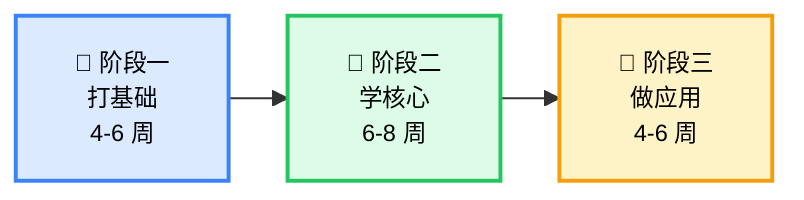
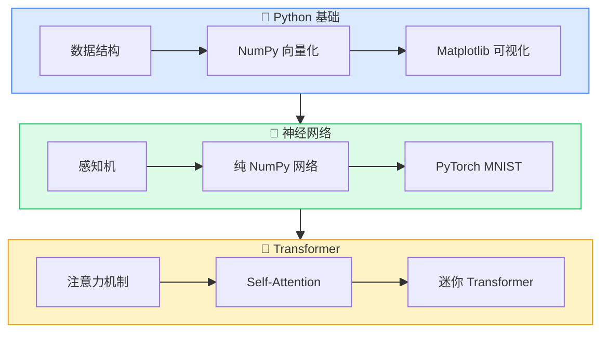
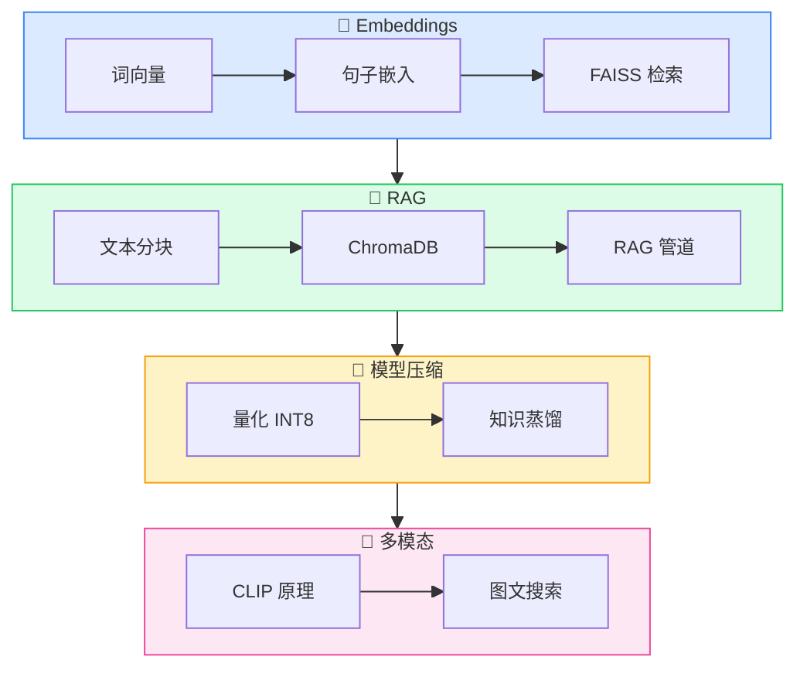
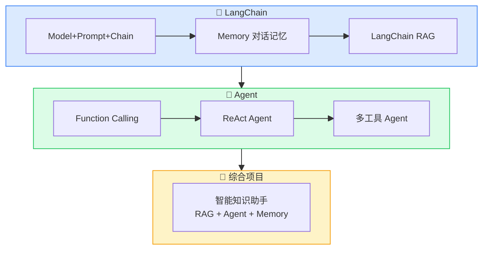
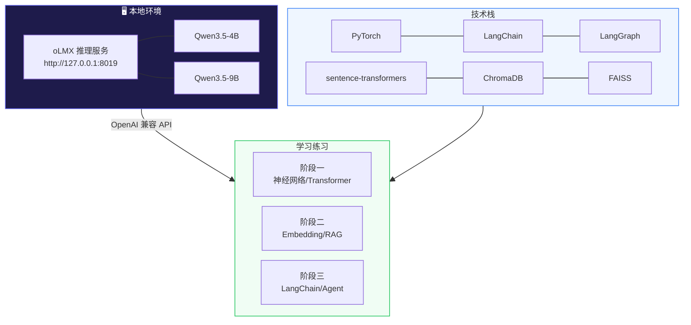
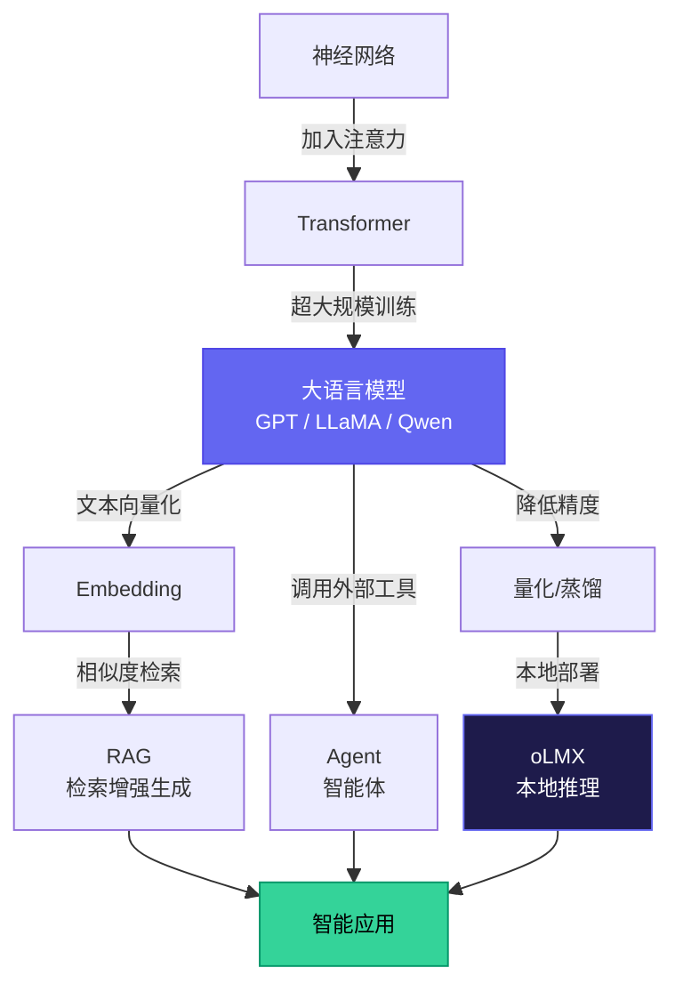

# 从零到 Agent：大模型全栈学习教程

<p align="center">
  <strong>一套面向编程小白的 AI 大模型实战学习路线</strong><br/>
  从 Python 基础到 Transformer，从 RAG 到 Agent，全程本地运行，无需云端 API
</p>

<p align="center">
  
  
  
  
</p>

---

**作者**: RJ.Wang
**邮箱**: wangrenjun@gmail.com
**创建时间**: 2026-04-22

---

## 这是什么？

这是一套从零开始的 AI 大模型学习教程，覆盖从 Python 基础到构建 AI Agent 的完整技能链。

每个练习都是可直接运行的代码（`.py` + `.ipynb`），配有详细的中文注释和原理讲解。全程使用本地 LLM 推理（[oLMX](https://github.com/jundot/omlx)），不需要 OpenAI API Key，不花一分钱。

### 两种学习模式

每个练习同时提供两种格式，内容完全一致，选你顺手的：

| 模式 | 格式 | 适合场景 |
|:---|:---|:---|
| 📓 Jupyter Notebook | `.ipynb` | 边学边练，推荐初学者 |
| 📄 Python 脚本 | `.py` | 快速运行，适合有经验的开发者 |

### 什么是 Jupyter Notebook？

如果你没接触过 `.ipynb` 文件，可以把它理解成一种"可执行的笔记本"——把文字讲解和代码混在一起，一个格子一个格子地写、一个格子一个格子地跑。

跟传统的 `.py` 脚本相比，它的好处是：

- **边看边跑** — 讲解和代码交替排列，读完一段原理，紧接着就能运行对应的代码看效果
- **逐步执行** — 不用一次跑完整个文件，一个单元格一个单元格地执行，出错了只改那一格就行
- **即时反馈** — 运行结果（数字、图表、报错信息）直接显示在代码下方，不用切换窗口
- **可以反复改** — 改了参数重新跑那一格就行，不用从头开始，特别适合"试试看改成这样会怎样"

你可以在 Kiro / VS Code 里直接打开 `.ipynb` 文件运行（需安装 Jupyter 插件），也可以用浏览器版的 Jupyter Notebook。

---

## 适合谁？

- 有基本编程经验（或愿意花几天学 Python 基础）的开发者
- 想系统了解大模型技术栈的后端/前端/运维工程师
- 对 AI 感兴趣但不知道从哪开始的小白
- 想在本地跑通 RAG + Agent 的实践者

---

## 学习路线总览



---

## 三个阶段详解

### 阶段一：打基础

> 从 Python 到 Transformer，建立 AI 的底层认知。



| 模块 | 练习 | 核心知识点 |
|------|------|-----------|
| Python 基础 | 3 个 | 列表/字典、NumPy 矩阵运算、数据可视化 |
| 神经网络 | 3 个 | 感知机、反向传播（纯 NumPy）、PyTorch 框架 |
| Transformer | 3 个 | 注意力机制、Q/K/V、多头注意力、位置编码 |

### 阶段二：学核心

> 掌握 Embedding、RAG、模型压缩、多模态四大核心技术。



| 模块 | 练习 | 核心知识点 |
|------|------|-----------|
| Embeddings | 3 个 | 余弦相似度、sentence-transformers、FAISS 向量检索 |
| RAG | 3 个 | 文本分块策略、ChromaDB、完整 RAG 管道（接 oLMX） |
| 模型压缩 | 2 个 | INT8 量化原理、知识蒸馏（大模型教小模型） |
| 多模态 | 2 个 | CLIP 对比学习、跨模态图文搜索 |

### 阶段三：做应用

> 用 LangChain 和 Agent 构建真实的 AI 应用。



| 模块 | 练习 | 核心知识点 |
|------|------|-----------|
| LangChain | 3 个 | LCEL 链式语法、多轮对话记忆、LangChain 版 RAG |
| Agent | 3 个 | Function Calling、ReAct 推理循环、多工具组合 |
| 综合项目 | 1 个 | RAG + Agent + Memory 整合的智能知识助手 |

---

## 技术架构



---

## 快速开始

### 1. 环境要求

| 要求 | 说明 |
|------|------|
| macOS + Apple Silicon | oLMX 需要 M1/M2/M3/M4 芯片 |
| Python 3.10+ | `python --version` 确认 |
| uv 包管理器 | `uv --version` 确认，[安装指南](https://docs.astral.sh/uv/getting-started/installation/) |
| oLMX | 从 [Releases](https://github.com/jundot/omlx/releases) 下载 `.dmg` 安装 |

### 2. 克隆项目

```bash
git clone <your-repo-url> LLMStudy
cd LLMStudy
```

### 3. 启动 oLMX

打开 oLMX App，确保至少加载了一个模型（推荐 Qwen3.5-9B）。
验证服务：

```bash
curl http://127.0.0.1:8019/v1/models -H "Authorization: Bearer your-api-key"
```

### 4. 开始学习

每个练习同时提供 `.py` 脚本和 `.ipynb` Notebook 两种格式（阶段一已全部转换，阶段二三后续补充），内容一致，选你喜欢的方式：

**方式一：在 Kiro / VS Code 中直接运行（推荐）**

如果你的 IDE 已安装 Jupyter 插件，直接点开 `.ipynb` 文件即可运行，无需命令行操作：

1. 在 Kiro / VS Code 中打开项目文件夹（如 `ai-learning-phase1`）
2. 点击任意 `.ipynb` 文件，IDE 会自动进入 Notebook 模式
3. 右上角选择 Kernel → 选择对应项目 `.venv` 下的 Python 解释器
4. 逐个单元格点击运行即可

> 💡 首次运行前需要先安装依赖：在终端中执行 `cd ai-learning-phase1 && uv sync`

**方式二：浏览器 Jupyter Notebook**

Notebook 把讲解和代码拆成一个个单元格，可以逐步执行、即时看到结果，非常适合学习。

```bash
cd ai-learning-phase1
uv run jupyter notebook
# 浏览器自动打开，点击 .ipynb 文件即可
```

**方式三：命令行直接运行**

```bash
# 阶段一
cd ai-learning-phase1
uv run python 01_python_basics/01_data_structures.py

# 阶段二
cd ai-learning-phase2
uv run python 04_embeddings/01_word_vectors.py

# 阶段三
cd ai-learning-phase3
uv run python 08_langchain/01_basics.py
```

---

## 项目结构

```
LLMStudy/
├── README.md                           ← 你正在看的文件
│
├── ai-learning-phase1/                 # 阶段一：打基础
│   ├── 01_python_basics/
│   │   ├── 01_data_structures.py / .ipynb
│   │   ├── 02_numpy_basics.py / .ipynb
│   │   └── 03_matplotlib_plot.py / .ipynb
│   ├── 02_neural_network/
│   │   ├── 01_perceptron.py / .ipynb
│   │   ├── 02_mnist_from_scratch.py / .ipynb
│   │   └── 03_mnist_pytorch.py / .ipynb
│   ├── 03_transformer/
│   │   ├── 01_attention.py / .ipynb
│   │   ├── 02_self_attention.py / .ipynb
│   │   └── 03_mini_transformer.py / .ipynb
│   └── README.md
│
├── ai-learning-phase2/                 # 阶段二：学核心
│   ├── 04_embeddings/
│   │   ├── 01_word_vectors.py
│   │   ├── 02_sentence_embeddings.py
│   │   └── 03_similarity_search.py
│   ├── 05_rag/
│   │   ├── 01_text_splitting.py
│   │   ├── 02_vector_store.py
│   │   └── 03_rag_pipeline.py          ← 接 oLMX 本地 LLM
│   ├── 06_model_compression/
│   │   ├── 01_quantization.py
│   │   └── 02_distillation.py
│   ├── 07_multimodal/
│   │   ├── 01_clip_concept.py
│   │   └── 02_image_text_search.py
│   └── README.md
│
├── ai-learning-phase3/                 # 阶段三：做应用
│   ├── 08_langchain/
│   │   ├── 01_basics.py
│   │   ├── 02_memory.py
│   │   └── 03_rag_chain.py
│   ├── 09_agent/
│   │   ├── 01_function_calling.py
│   │   ├── 02_react_agent.py
│   │   └── 03_multi_tool_agent.py
│   ├── 10_project/
│   │   └── 01_knowledge_assistant.py   ← RAG + Agent + Memory 综合
│   └── README.md
│
└── .python-version
```

---

## 核心知识脉络



---

## 为什么选择 oLMX？

本教程全程使用 [oLMX](https://omlx.ai/) 作为本地 LLM 推理后端，而不是 OpenAI API：

| 对比 | oLMX 本地 | OpenAI 云端 |
|------|-----------|-------------|
| 费用 | 免费 | 按 token 计费 |
| 隐私 | 数据不出本机 | 数据上传云端 |
| 速度 | 无网络延迟 | 受网络影响 |
| 可用性 | 离线可用 | 需要网络 |
| API 兼容 | OpenAI 格式 | 原生 |

代码完全兼容 OpenAI API，切换到云端只需改环境变量：

```bash
# 切换到 OpenAI
export OPENAI_BASE_URL="https://api.openai.com/v1"
export OPENAI_API_KEY="sk-..."

# 切回 oLMX
unset OPENAI_BASE_URL OPENAI_API_KEY
```

---

## 学完之后？

完成全部三个阶段后，你将具备：

- 从零搭建神经网络和 Transformer 的能力
- 构建完整 RAG 系统的实战经验
- 使用 LangChain + Agent 开发 AI 应用的技能
- 对大模型技术栈的系统性理解

**推荐的进阶方向：**

| 方向 | 建议 |
|------|------|
| 应用开发 | 用 FastAPI + Docker 部署你的 RAG/Agent 应用 |
| 模型微调 | 学习 LoRA/QLoRA 在自己的数据上微调模型 |
| Agent 进阶 | 学习 LangGraph 构建多步骤工作流 |
| 生产部署 | 学习 MLOps、模型监控、A/B 测试 |

---

## 许可证

本教程仅供学习使用。
