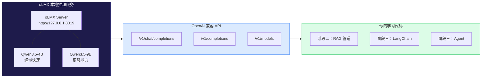
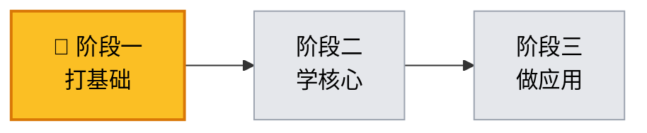
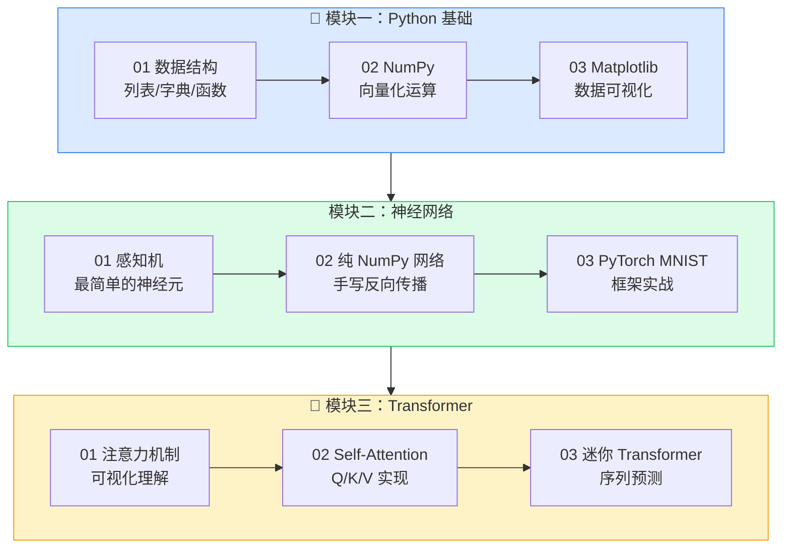
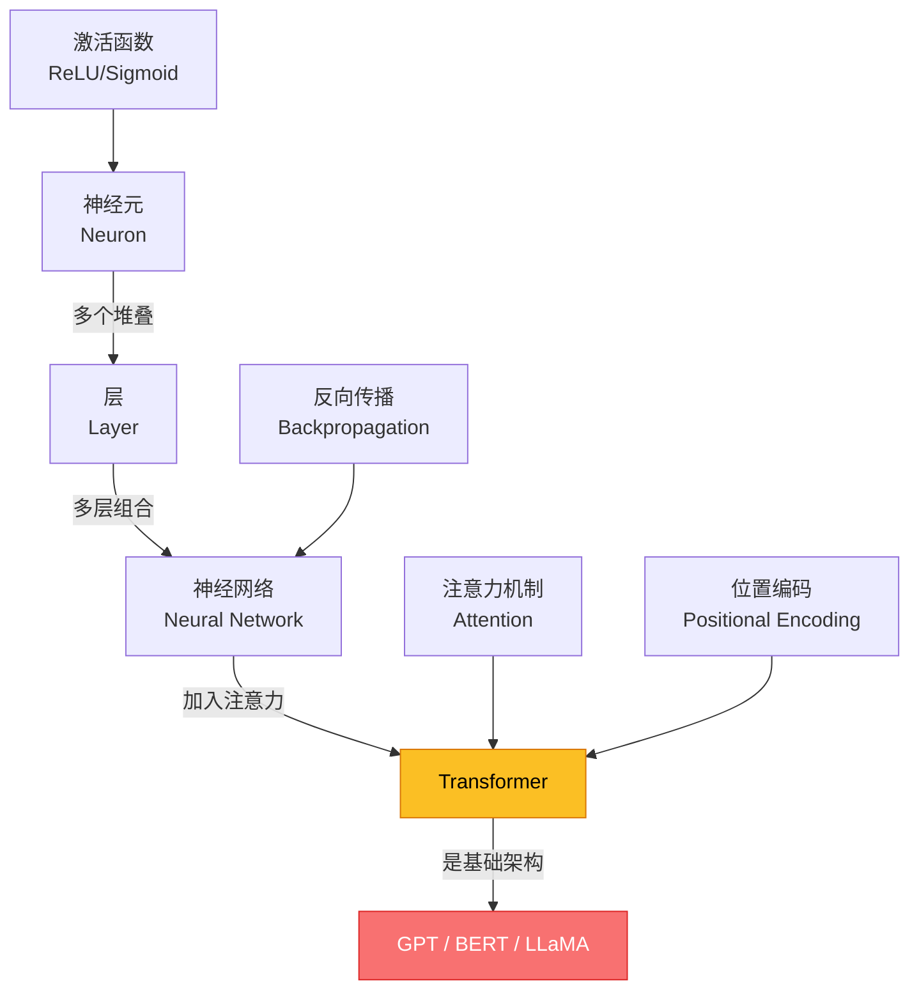
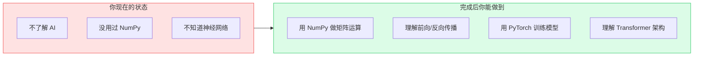
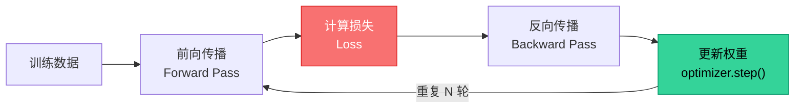

# AI 大模型学习 - 阶段一：打基础

**作者**: RJ.Wang
**邮箱**: wangrenjun@gmail.com
**创建时间**: 2026-04-22

---

## 前置条件

开始本阶段学习前，请确认你已具备以下条件：

| 类别 | 要求 | 说明 |
|------|------|------|
| 💻 硬件 | 任意电脑 | 不需要 GPU，CPU 即可完成所有练习 |
| 🐍 Python | 已安装 Python 3.10+ | 运行 `python --version` 确认 |
| 📦 uv | 已安装 uv 包管理器 | 运行 `uv --version` 确认 |
| 🧠 知识 | 高中数学基础 | 理解函数、矩阵乘法的概念即可 |
| 🌐 网络 | 可访问 PyPI | 首次运行需下载依赖包 |
| 🤖 oLMX | 本地 LLM 推理服务（可选） | 阶段一不强制要求，但建议提前安装熟悉 |

> 如果你完全没有编程经验，建议先花 1-2 天在 [Python 官方教程](https://docs.python.org/zh-cn/3/tutorial/) 上了解基本语法（变量、if/for、函数），然后再开始本阶段。

---

## 本地 LLM 环境：oLMX

本教程全程使用 [oLMX](https://github.com/jundot/omlx) 作为本地 LLM 推理后端，从阶段二开始会深度使用。建议在阶段一学习期间提前安装好。



**为什么用 oLMX？**
- 完全本地运行，不需要 OpenAI API Key，不花钱
- 兼容 OpenAI API 格式，代码可以无缝切换到云端 API
- 专为 Apple Silicon 优化，在 Mac 上跑得飞快
- 管理后台可视化：`http://127.0.0.1:8019/admin/dashboard`

**安装方式（macOS）：**
从 [oLMX Releases](https://github.com/jundot/omlx/releases) 下载 `.dmg`，拖入 Applications 即可。详见 [oLMX 官网](https://omlx.ai/)。

**验证服务是否正常：**
```bash
curl http://127.0.0.1:8019/v1/models -H "Authorization: Bearer your-api-key"
```

---

## 学习路线总览

本阶段在整个学习路线中的位置：



---

## 阶段一内部学习流程



---

## 核心概念关系图



---

## 项目结构

```
ai-learning-phase1/
├── 01_python_basics/               # Python 基础
│   ├── 01_data_structures.py           # 数据结构练习
│   ├── 02_numpy_basics.py              # NumPy 入门
│   └── 03_matplotlib_plot.py           # 数据可视化
├── 02_neural_network/              # 神经网络
│   ├── 01_perceptron.py                # 感知机：最简单的神经元
│   ├── 02_mnist_from_scratch.py        # 手写数字识别（纯 NumPy）
│   └── 03_mnist_pytorch.py             # 手写数字识别（PyTorch）
├── 03_transformer/                 # Transformer
│   ├── 01_attention.py                 # 注意力机制可视化
│   ├── 02_self_attention.py            # Self-Attention 实现
│   └── 03_mini_transformer.py          # 迷你 Transformer
└── README.md
```

---

## 运行方式

每个练习同时提供 `.py` 脚本和 `.ipynb` Notebook 两种格式，内容一致，选你喜欢的方式：

**方式一：Jupyter Notebook（推荐初学者）**
```bash
cd ai-learning-phase1
uv run jupyter notebook
# 浏览器会自动打开，点击 .ipynb 文件即可逐单元格运行
```

**方式二：命令行直接运行**
```bash
cd ai-learning-phase1
uv run python 01_python_basics/01_data_structures.py
```

---

## 每个练习的学习目标



| 模块 | 练习 | 你将学到 | 预计时间 |
|------|------|----------|----------|
| Python 基础 | 01 数据结构 | 列表/字典/函数，AI 编程的基本功 | 2h |
| Python 基础 | 02 NumPy | 向量化运算，矩阵乘法（神经网络的核心操作） | 3h |
| Python 基础 | 03 Matplotlib | 可视化激活函数、损失曲线、数据分布 | 2h |
| 神经网络 | 01 感知机 | 神经元如何工作，权重更新，线性可分的局限 | 2h |
| 神经网络 | 02 纯 NumPy | 前向传播、反向传播、梯度下降的完整实现 | 4h |
| 神经网络 | 03 PyTorch | Dataset/DataLoader/Model/Optimizer 的使用 | 3h |
| Transformer | 01 注意力 | 注意力分数计算、Softmax、加权求和 | 2h |
| Transformer | 02 Self-Attention | Q/K/V 投影、缩放点积、多头注意力 | 3h |
| Transformer | 03 迷你 Transformer | 位置编码、残差连接、完整架构 | 3h |

---

## 训练过程可视化

下面是你在练习中会看到的典型训练过程：



---

## 完成标志

当你能回答以下问题时，说明阶段一已经掌握：

- [ ] NumPy 的 `@` 运算符是什么意思？
- [ ] 什么是激活函数？为什么需要它？
- [ ] 反向传播的核心思想是什么？
- [ ] PyTorch 中 `loss.backward()` 做了什么？
- [ ] Transformer 中 Q、K、V 分别代表什么？
- [ ] 为什么需要位置编码？
- [ ] 多头注意力比单头注意力好在哪里？

全部打勾后，进入 **阶段二：学核心** 🚀
