# 🧠 RAG & Fine-tuning 小白学习指南

**作者**: RJ.Wang
**邮箱**: wangrenjun@gmail.com
**创建时间**: 2026-04-23
**内容来源**: 小林coding 公众号文章整理

---

## 📖 前言：大模型为什么需要"补课"？

想象一下，你高考结束后再也不看新闻、不学新知识。三年后有人问你"今天股价多少"，你肯定答不上来。

**大模型（LLM）也是一样。** 它训练完之后，知识就"冻住"了：

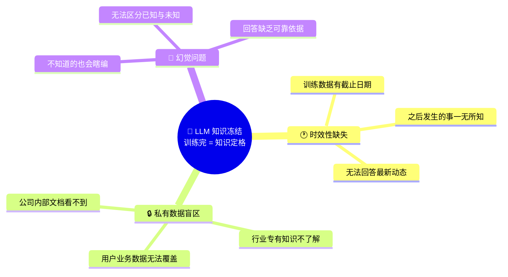

那怎么给大模型"补课"呢？业界有两条路：

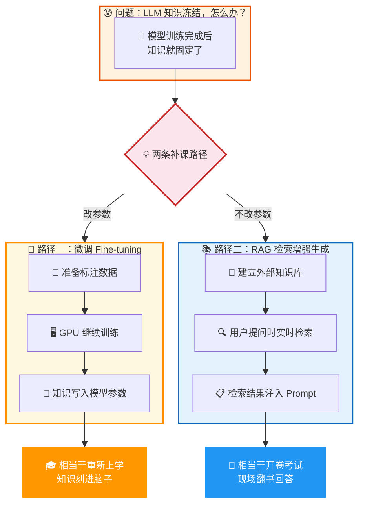

下面我们一个一个来学。

---

## 第一部分：什么是 RAG？

### 1.1 一句话理解

**RAG = Retrieval-Augmented Generation = 检索增强生成**

> 用户提问 → 先去知识库里搜相关资料 → 把资料和问题一起交给大模型 → 大模型基于资料回答

就像你考试时可以翻书一样，大模型不用死记硬背，现场查资料就行。

### 1.2 RAG 的完整工作流程

RAG 分为两个阶段：**离线建库** 和 **在线问答**。

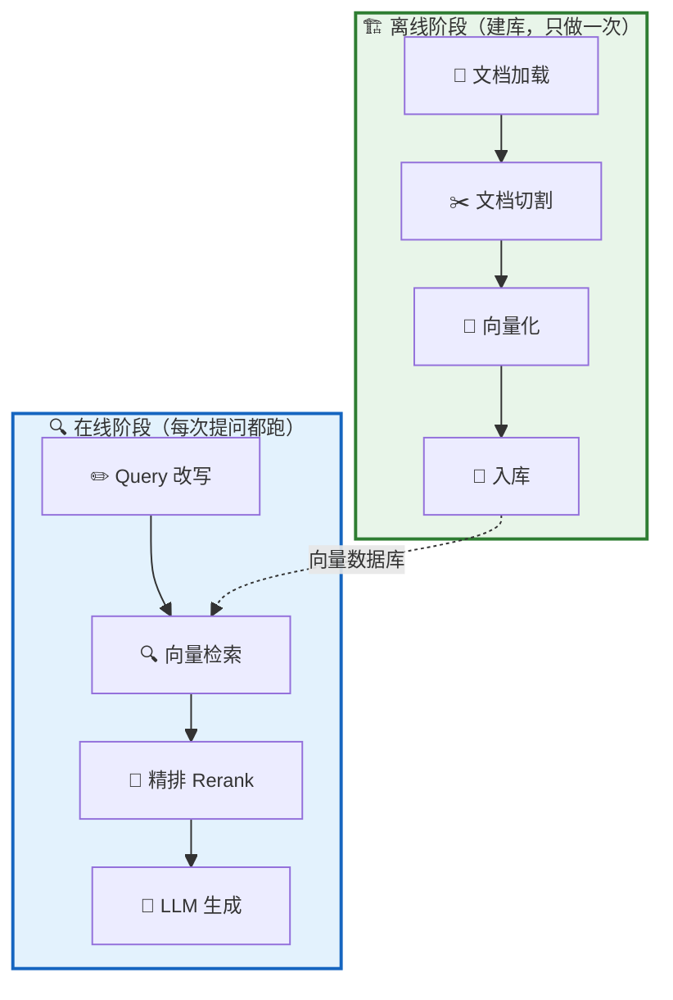

---

#### 🏗️ 离线阶段：提前把知识库建好（只做一次）

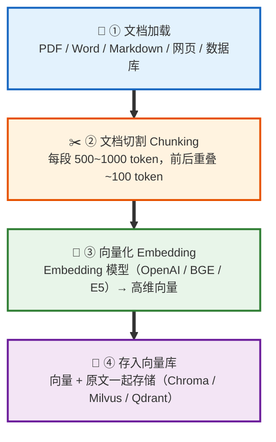

**① 文档加载**
把各种格式的原始数据读进来。PDF、Word、Markdown、网页都行。

**② 文档切割（Chunking）— 为什么要切？**

两个原因：
- 向量模型有长度限制，整篇文档塞不进去
- 整篇文档压缩成一个向量，细节会被"平均掉"

> 🍜 比喻：你问"这道菜怎么样"，对方回答"中国菜整体偏咸"
> → 具体哪道菜咸、咸到什么程度，全丢失了

实践建议：
- 每个 chunk 大小：500～1000 token
- 前后重叠 100 token，避免把完整语义从中间切断

**③ Embedding（向量化）— 最核心的一步**

把文字转成一串数字（高维向量），比如 1536 维的浮点数列表。

> 🗺️ 比喻：想象一个"语义坐标系"
> - "苹果手机怎么截图" 和 "iPhone 如何截屏"
> - 用词完全不同，但意思一样 → 向量位置非常接近
> - 这就是语义检索的基础：不匹配关键词，而是比较"意思相不相近"

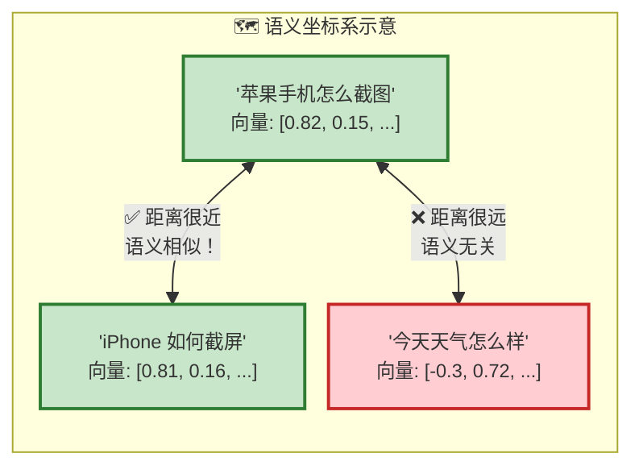

**④ 入库**
向量 + 原始文本一起存进向量数据库（Chroma、Milvus、Qdrant 等）。

---

<details>
<summary>💬 点击展开 · 学习过程中的真实疑问，逐层递进（Q1~Q6）</summary>
<div style="color: #2e7d32; font-size: 0.85em;">

**Q1：为什么整篇文档不能直接做 Embedding？**

Embedding 模型不管你输入 100 字还是 10000 字，最终都只输出一个固定长度的向量。内容越多越杂，这个向量就越"模糊"——就像把很多种颜料混在一起，最后变成一团灰色。

```
一篇公司手册（请假 + 报销 + 绩效 + 出差）
        ↓ 整篇做 Embedding
  [0.3, 0.25, 0.1, ...]  ← 一个"啥都像又啥都不像"的模糊向量

用户问 "出差补贴标准是多少"
        ↓ 跟模糊向量比较
  相似度不高 ❌ → 因为"出差"只占四分之一，被其他话题稀释了
```

切成小段后，每段的向量精准代表那段内容，检索才能命中：

```
chunk 1: 请假制度 → 精准代表"请假"
chunk 2: 报销流程 → 精准代表"报销"
chunk 3: 绩效考核 → 精准代表"绩效"
chunk 4: 出差规定 → 精准代表"出差" ← 用户问出差，直接命中！
```

**Q2：Chunking 和 Embedding 是什么关系？**

完全不同的两件事，但是流水线上的前后两道工序：

- **Chunking** — 解决"怎么分"。纯文本处理，不涉及任何模型，本质就是分段。
- **Embedding** — 解决"怎么表示"。用模型把文本转成数字向量，让计算机能用数学方式比较语义。

```
长文档 → [Chunking 切成小段] → 一堆 chunk → [Embedding 逐个转向量] → 一堆向量 → 存入向量库
```

🥩 比喻：Chunking 是把一整头牛分切成部位（牛腩、牛腱、牛排），Embedding 是给每个部位贴上标签（适合炖、适合卤、适合煎）。切是切，贴标签是贴标签，但不切就没法精准贴标签。

**Q3："1536 维浮点数列表"到底是什么？**

拆开来看：

- **列表** — 就是一个一维数组
- **1536 维** — 数组里有 1536 个元素（格子）
- **浮点数** — 每个格子里是一个小数，如 `0.1234567`

```
[0.12, -0.34, 0.56, 0.01, ..., -0.78]
 格子1   格子2   格子3  格子4  ...  格子1536
```

为什么要这么多格子？因为语言的含义太丰富，少量数字描述不清楚。就像用 [身高, 体重] 两个数字描述一个人太粗糙，用 1536 个维度才能精细地刻画一段文字的语义。

不同模型维度不同，1536 不是物理定律，是设计者选的平衡点：

| 模型 | 维度 |
|:---|:---:|
| OpenAI text-embedding-ada-002 | 1536 |
| OpenAI text-embedding-3-large | 3072 |
| BGE-large | 1024 |
| BGE-small | 512 |

**Q4：浮点数的精度是无穷的吗？**

不是。计算机用固定位数的二进制存储浮点数，精度有上限：

| 类型 | 位数 | 有效精度 | 可表示的不同值 |
|:---|:---:|:---:|:---:|
| float32（单精度） | 32 bit | 约 7 位小数 | ≈ 43 亿个 |
| float16（半精度） | 16 bit | 约 3~4 位小数 | ≈ 65536 个 |

大多数 Embedding 模型输出 float32。单个格子有约 43 亿种取值，1536 个格子的组合数是 43亿^1536 —— 大到完全不用担心"不够用"，但严格来说确实是有限的、离散的。

**Q5：每个 chunk 最终对应什么数据结构？**

一个长度为 1536 的一维数组。向量数据库里每条记录存两样东西：

```
chunk 1: "请假需提前3天申请..."  →  [0.12, -0.34, 0.56, ..., -0.78]  (1536个float32)
chunk 2: "报销需提供发票..."    →  [0.45, 0.23, -0.11, ..., 0.33]   (1536个float32)
chunk 3: "出差补贴标准..."      →  [-0.08, 0.67, 0.29, ..., 0.15]   (1536个float32)
```

检索时，用户问题也过同一个 Embedding 模型得到同样长度的数组，然后逐个算距离（余弦相似度），距离最近的就是最相关的 chunk。

**Q6：数组里元素的位置是任意的还是固定的？**

**固定的，不能换。** 同一个 Embedding 模型输出的向量，第 N 个位置永远捕捉同一种语义特征。比较两个向量时，是同位置对同位置比的：

```
chunk 向量:  [0.12,  -0.34,  0.56,  ...,  -0.78]
问题向量:    [-0.07,  0.65,  0.31,  ...,   0.14]
               ↕       ↕      ↕             ↕
             位置1   位置2   位置3   ...   位置1536
             逐个对比，算整体距离
```

如果打乱某个向量的元素顺序，它就变成一个完全不同的"语义肖像"，检索结果会完全错乱。

但具体每个位置代表什么语义特征？人类说不清楚——这些特征是模型训练时自己学出来的，不是人为定义的。类比 RGB 颜色 `[红, 绿, 蓝]` 每个位置含义明确，而 Embedding 的 1536 个位置，模型自己懂，人类只知道"位置固定、不能乱换"。

💡 一句话总结：每个 token 在模型内部确实各有一个向量（模型在"逐词阅读"），但最终会通过 pooling 汇总成一个向量输出，这个向量才是存入向量库、用来做检索的东西。文档太长时，汇总向量会变模糊，所以要先 Chunking 再 Embedding。

</div>
</details>

<details>
<summary>💬 点击展开 · Chunking 实操和数据最终形态（Q11~Q12）</summary>
<div style="color: #2e7d32; font-size: 0.85em;">

**Q11：Chunking 具体怎么做？是把一个长 PDF 切成若干短 PDF 吗？**

不是切文件，是切文字。PDF 只是原始数据的容器，加载器把文字提取出来之后，容器就没用了，后面全是对纯文本字符串的操作：

```
原始 PDF 文件
    ↓ 文档加载（提取文字，PDF 格式/排版/图片全丢掉，只留文字）
一大段纯文本字符串
    ↓ Chunking（按语义断点切割文本）
若干段短文本字符串（在内存里，不是新文件）
    ↓ Embedding → 入库
```

切割时会按优先级依次尝试在这些位置断开：段落分隔符 `\n\n` → 换行符 `\n` → 句号等句末标点 → 逗号等句中标点 → 空格 → 硬切。目标是尽量在语义完整的地方断开，而不是把一句话从中间劈开。

**Q12：数据的最终形态是什么？**

两样东西：原始 PDF（备份用，不影响系统运行）和向量数据库。向量数据库里每条记录同时存了**向量 + 原文 chunk**：

```
向量数据库里每条记录：
┌──────────────────────────────────────────────────┐
│  向量: [0.12, -0.34, 0.56, ..., -0.78]           │ ← 用来检索（算相似度）
│  原文: "出差补贴标准为每天200元，需提供..."         │ ← 用来给 LLM 读
└──────────────────────────────────────────────────┘
```

向量只是一串数字，LLM 读不懂。检索命中后，真正塞进 prompt 给 LLM 看的是原文文本，不是向量。

</div>
</details>

---

#### 🔍 在线阶段：用户提问时实时检索（每次都跑）

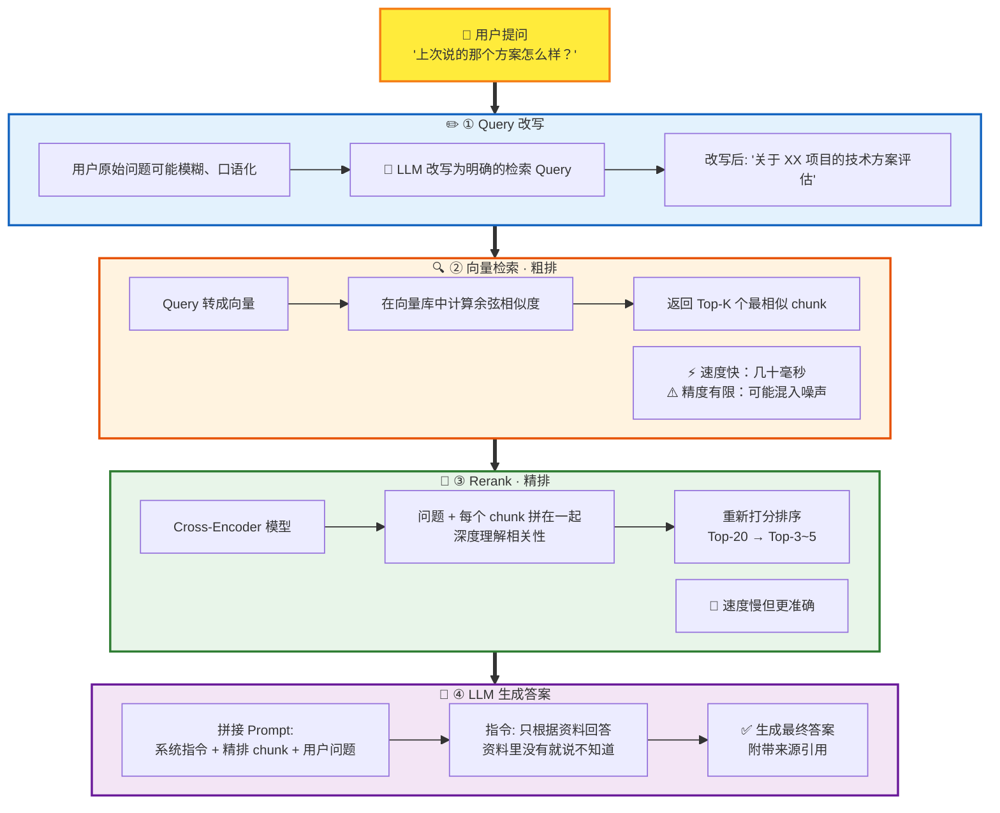

**① Query 改写**
用户说"上次说的那个方案怎么样"，检索系统根本不知道"上次"是什么。
→ 让 LLM 先把问题改写成更明确的形式

<details>
<summary>💬 点击展开 · Query 改写的常见疑问（Q7~Q8）</summary>
<div style="color: #2e7d32; font-size: 0.85em;">

**Q7：LLM 是怎么知道"上次"指的是哪个项目？**

LLM 不是凭空猜的，它靠的是**对话历史（conversation memory）**。RAG 系统会把最近几轮对话一起传给 LLM，让它结合上下文来改写：

```
对话历史（系统维护的）:
├─ 用户: "帮我看看 XX 项目的技术方案"
├─ AI:   "XX 项目的技术方案包含三个模块..."
├─ 用户: "第二个模块的风险评估呢"
├─ AI:   "第二个模块主要风险有..."
└─ 用户: "上次说的那个方案怎么样"  ← 当前提问（模糊）

LLM 结合对话历史，改写为:
→ "XX 项目技术方案的评估和进展情况"  ← 指代消解完成
```

如果没有对话历史，LLM 确实不知道"上次"是什么。这时好的系统会让 AI 反问用户"你说的是哪个方案？"，而不是硬猜。

💡 所以 Query 改写的前提是系统必须维护对话记忆。它不只是改措辞，更重要的是**把对话上下文中的指代关系解析清楚**，让后面的向量检索能拿到一个语义完整的查询。

**Q8：Query 改写算 RAG 的一部分吗？**

严格来说，不算。RAG 论文的核心定义就三步：**检索 → 拼接 → 生成**。只要在生成之前从外部检索了知识注入 prompt，就算 RAG。

但在实际工程中，Query 改写几乎是标配。两者的关系是：

| 层面 | 包含什么 |
|:---|:---|
| RAG 的学术定义 | 检索 + 增强 + 生成 |
| RAG 的工程实践 | Query 改写、对话记忆、Chunking 策略、Embedding、向量检索、Rerank、Prompt 模板、生成、引用溯源、效果评估… |

🍳 比喻："做菜"的定义是把食材加热变熟，但实际做菜你还得洗菜、切菜、调味、摆盘。Query 改写就像"洗菜切菜"——不是做菜的定义，但你不做就不好吃。

</div>
</details>

---

**② 向量检索（粗排）**
问题也转成向量，在向量库里找距离最近的 Top-K 个 chunk。
- 速度快：百万级向量库，几十毫秒返回
- 但不够精：可能混入"看着近但其实不相关"的内容

<details>
<summary>💬 点击展开 · 向量检索的常见疑问（Q9~Q10）</summary>
<div style="color: #2e7d32; font-size: 0.85em;">

**Q9：Top-K 是什么意思？**

K 就是你自己定的一个数字，Top-K = 取相似度排名最靠前的 K 个结果。假设向量库里有 10000 个 chunk，系统算出每个 chunk 跟问题的相似度后从高到低排序，K=20 就取前 20 个。

```
排名1: chunk_892   相似度 0.95  ← 最像
排名2: chunk_3401  相似度 0.91
排名3: chunk_127   相似度 0.88
...
排名20: chunk_44   相似度 0.72  ← Top-20 的末位
------- 以下丢弃 -------
排名21~10000: 不够相关，不要了
```

K 设多少合适？没有标准答案：粗排阶段一般 K 设大一点（如 20），多捞候选，宁可多不可漏；精排之后再缩到 3~5 个，只留真正相关的交给 LLM。K 太小容易漏掉相关内容，K 太大会给 LLM 塞入太多噪声还浪费 token，实际项目里需要根据效果调。

**Q10：余弦相似度是怎么比较两个向量的？**

核心直觉：比的是两组数字代表的"方向"像不像，跟数字大小无关。输出一个分数：1 = 完全一致，0 = 毫无关系，-1 = 完全相反。

计算分三步，用一个 3 维的小例子演示：

```
向量A = [1, 2, 3]
向量B = [2, 2, 1]

① 逐位相乘:  1×2, 2×2, 3×1  →  2, 4, 3
② 求和:      2 + 4 + 3      →  9（这叫"点积"）
③ 归一化:    9 ÷ (向量A的长度 × 向量B的长度) → 0.80
```

前两步好理解，关键是第三步：**为什么要除以长度？**

类比考试成绩——满分不同的两门课，不能直接比分数：

```
小明 数学 80 分（满分 100）→ 80/100 = 80%
小红 英语 120 分（满分 150）→ 120/150 = 80%
```

直接比分数 120 > 80，小红赢？不对，换算成百分比才公平。

余弦相似度里除以长度，道理一样：
- **点积 = 原始分数**（受向量数字大小影响，没法直接比）
- **除以长度 = 换算成百分比**（消除大小差异，只比方向）
- **结果 -1 到 1 = 方向相似度的"百分比"**

放到 1536 维也是一模一样的三步，只不过要乘 1536 次、加 1536 个数。计算机算这些很快，几十毫秒就能把上万个 chunk 都比完。

</div>
</details>

**③ Rerank（精排）**
用 Cross-Encoder 模型把问题和每个候选 chunk 拼在一起深度理解。

> 📚 比喻：
> - 粗排 = 用肉眼在书架上快速扫一遍，把可能相关的书都抽出来
> - 精排 = 一本一本翻开读目录，确认哪些真正有用

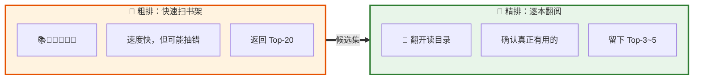

通常对 Top-20 做精排，最终留 Top-3 到 Top-5。

**④ LLM 生成**
问题 + 精排后的 chunk 拼成 prompt，交给 LLM。
Prompt 里会明确说："只根据提供的资料回答，资料里没有就说不知道"。

<details>
<summary>💬 点击展开 · RAG 和 LLM 都有"向量化"，有什么区别？（Q13~Q15）</summary>
<div style="color: #2e7d32; font-size: 0.85em;">

**Q13：LLM 内部也有向量化和入库吗？**

LLM 内部有向量化，但没有入库。两者机制完全不同：

| | RAG 的向量化 | LLM 内部的向量化 |
|:---|:---|:---|
| 目的 | 存起来，以后检索用 | 当场计算用，用完就丢 |
| 存储 | 存入向量数据库，持久化 | 不存，只在内存中临时存在 |
| 模型 | 专门的 Embedding 模型 | LLM 自带的 Embedding 层 |
| 输出 | 一段文字 → 一个向量 | 每个 token → 一个向量 |
| 用途 | 语义检索（找相似内容） | 语义理解（生成下一个词） |

LLM 的知识不是存在某个数据库里，而是分散在模型的几十亿个权重参数中。你下载一个模型文件（如 Qwen3.5-9B），下载的就是这些权重参数（`.safetensors` 文件）+ 一个分词字典（`tokenizer.json`）。训练数据在训练完成后就不需要了——知识已经以数学参数的形式"烧"进了权重里，但不是原样存储，而是被压缩成了统计规律。

**Q14：检索到 chunk 后，LLM 是不是再做一次"比对"？**

不是。整个 RAG 流程里，"比对"只发生一次——向量检索那一步（用户问题向量 vs chunk 向量算余弦相似度）。

检索命中后，LLM 做的是**阅读理解 + 生成回答**，不是比对：

```
1. 向量检索命中 → 拿到原文 chunk（直接从向量数据库取，不用回 PDF 找）
2. 拼成 prompt：系统指令 + 检索到的原文 + 用户问题
3. LLM 内部：tokenizer → 向量化 → Transformer 计算（这是在"阅读"prompt）
4. LLM 输出答案（这是在"回答"，不是在"比对"）
```

就像你读一段材料然后回答问题，你的大脑确实在处理文字，但你不是在"比对"，你是在理解和组织答案。

**Q15：训练完模型后，原始训练数据还需要吗？**

从"使用模型"的角度，不需要了。模型是独立的，跑推理只需要权重文件。但知识是被"压缩"存储的，不是原样保留——模型学到了规律和模式，但无法逐字还原训练数据。保留训练数据通常是为了重新训练下一代模型或合规审计，跟使用模型无关。

**Q16：LLM 发布后的文件存的全是向量数据吗？**

不是。你下载一个模型（比如 Qwen3.5-9B），拿到的文件主要就两样：

1. **权重文件（`.safetensors`）**— 模型的"大脑"。存的是几十亿个浮点数，但这些数字不是某段文字的向量表示，而是神经网络每一层的**连接强度**（参数）。打个比方：你的大脑之所以"知道"猫长什么样，不是因为脑子里存了一张猫的照片，而是因为神经元连接的强弱模式编码了"猫"的概念。模型权重也是一样。

2. **分词字典（`tokenizer.json`）**— 模型的"字典"。告诉模型怎么把文字拆成 token。比如"你好世界"可能被拆成 `["你好", "世界"]`，对应编号 `[109266, 8891]`。

| | 模型权重文件 | 向量数据库 |
|:---|:---|:---|
| 存的是什么 | 神经网络的连接强度（参数） | 文本/图片的语义表示（向量） |
| 怎么来的 | 训练出来的 | 用 Embedding 模型算出来的 |
| 用途 | 理解语言、生成文字 | 语义检索（找相似内容） |
| LLM 需要吗 | 必须，这就是模型本身 | 不需要，只有 RAG 系统才用 |

**Q17：LLM 不需要向量数据库？**

对。LLM 本身不需要向量数据库。你直接问 Qwen3.5-9B 一个问题，它从权重参数里"回忆"知识然后回答，整个过程不涉及任何数据库。

```
纯 LLM（不需要向量数据库）：
  用户提问 → LLM 从参数中回忆 → 回答

RAG = LLM + 向量数据库：
  用户提问 → 先去向量数据库检索相关资料 → 把资料塞给 LLM → LLM 基于资料回答
```

向量数据库是给 LLM 配的"外挂资料库"，让它回答前先翻书，而不是纯靠记忆。没有向量数据库，LLM 照样能跑；加上向量数据库，LLM 回答得更准。

**Q18：tokenizer.json 一般有多大？支持中英文的话，要包含所有词语吗？**

一般几 MB 到十几 MB，很小（Qwen3.5-9B 的是 19MB，词汇表 248,044 个 token）。

不需要包含所有词语。它用的是**子词拆分（BPE）**，核心思路：

1. 先把所有文字拆成最小单位（单个字节，256 个）
2. 统计训练数据中哪些字节组合出现频率最高
3. 把高频组合合并成一个新 token
4. 重复直到词汇表达到目标大小

所以常见词整个收录（效率高），罕见词拆成小片（兜底）：

```
"人工智能" → 1 个 token（高频词，整体收录）
"机器学习" → 1 个 token（高频词，整体收录）
"哈基米"   → 可能被拆成 "哈" + "基" + "米"（3 个 token）
```

任何文字都能被表示，只是罕见词会被拆成更多 token。这也解释了为什么 token 数 ≠ 字数。

**Q19：tokenizer.json 和 .safetensors 的关系是什么？每个 token 对应一组向量吗？**

对。两者配合工作，以 Qwen3.5-9B 的实际数据为例：

```
tokenizer.json 里:
  "你好" → 编号 109266
  "中国" → 编号 96328
  "的"   → 编号 95726
  共 248,044 个 token

safetensors 里的 embed_tokens 层:
  shape = [248320, 4096]
           ↑        ↑
       248320 行   每行 4096 个数字
    (≥ 词汇表大小)  (每个 token 的向量维度)
```

完整流程：

```
用户输入 "你好"
    ↓
tokenizer.json 查表: "你好" → 编号 109266
    ↓
safetensors 的 embed_tokens: 取第 109266 行
    ↓
得到一个 4096 维的向量: [0.12, -0.34, 0.56, ..., 0.78]
    ↓
这个向量进入 Transformer 的 32 层计算
    ↓
最终输出下一个 token
```

`tokenizer.json` 负责"文字 → 编号"，`safetensors` 里的 embedding 层负责"编号 → 向量"。一个是字典，一个是查找表。

</div>
</details>

---

### 1.3 RAG 的核心价值

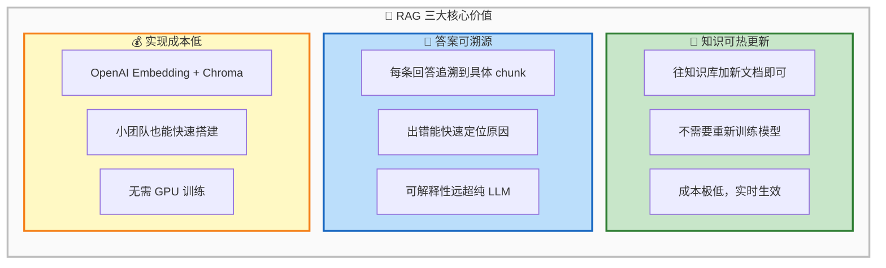

---

## 第二部分：什么是微调（Fine-tuning）？

### 2.1 一句话理解

**微调 = 用你自己的数据继续训练模型，让它把新知识"记"进参数里**

> 相当于让模型重新上了一遍学，把你的业务知识刻进它的"大脑"

### 2.2 微调的工作原理

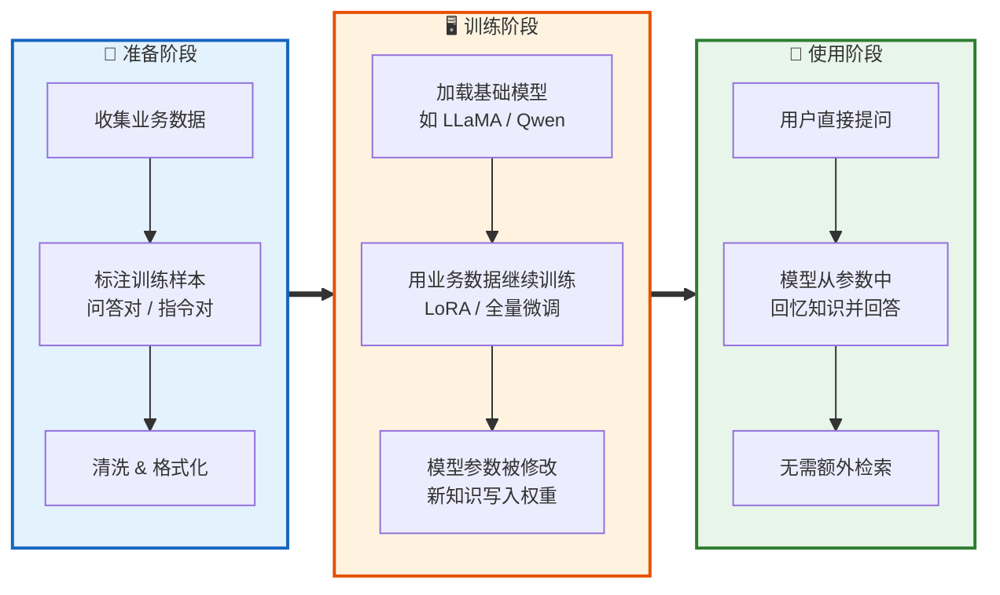

### 2.3 微调的优势与代价

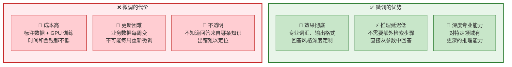

> ⚠️ 常见误区：以为微调后模型就"懂"了你的业务
> 实际上模型只是记住了训练数据里的模式，它到底记住了什么、记错了什么，你无从得知

---

## 第三部分：RAG vs 微调 — 怎么选？

### 3.1 核心对比表

| 维度 | 🔧 微调 Fine-tuning | 📚 RAG |
|:---:|:---:|:---:|
| 本质 | 改模型参数 | 不改参数，推理时现查 |
| 知识更新 | 需重新训练，成本高 | 更新知识库即可，实时生效 |
| 推理延迟 | 低 | 较高（多一次检索） |
| 实现成本 | 高（GPU + 标注数据） | 低（向量库 + Embedding） |
| 答案溯源 | ❌ 不支持 | ✅ 可追溯到 chunk |
| 适合场景 | 定制风格 / 深度专业 | 知识问答 / 动态更新 |
| 知识上限 | 受限于训练数据 | 受限于检索质量 |

### 3.2 选型决策树

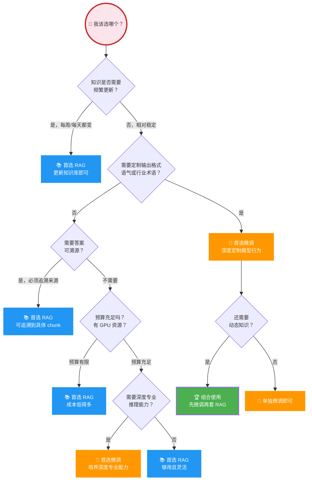

### 3.3 最佳实践：组合使用

实际工程中最常见的做法是**两个都用**：

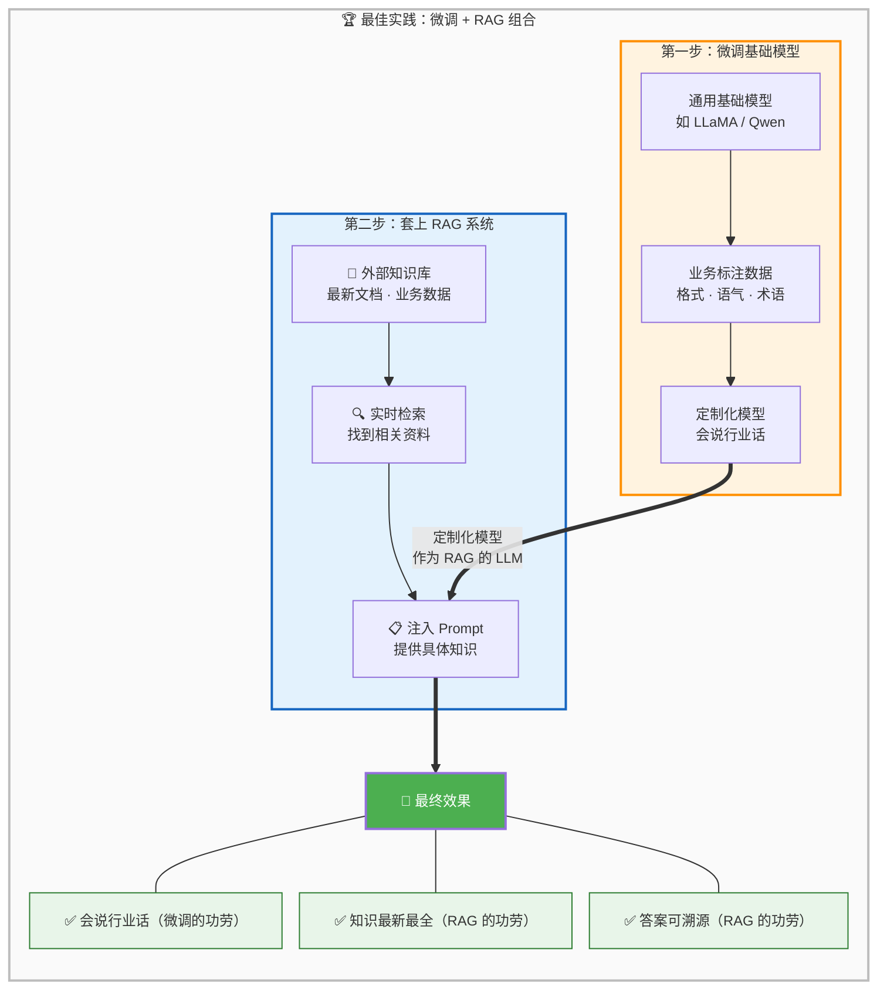

---

## 第四部分：一个关键洞察 💡

> **RAG 系统调优的主战场永远是检索层，不是换更强的 LLM。**

为什么？因为 LLM 只是在"复述和整理"检索到的内容：

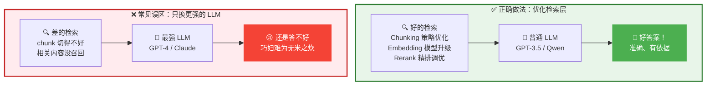

很多人一上来就想用 GPT-4 换掉 GPT-3.5 来提升效果，这往往是南辕北辙。

真正该优化的三个方向：

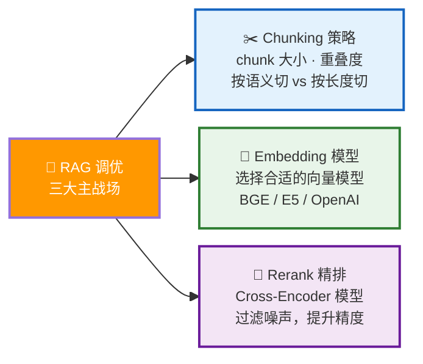

---

## 第五部分：用生活比喻总结

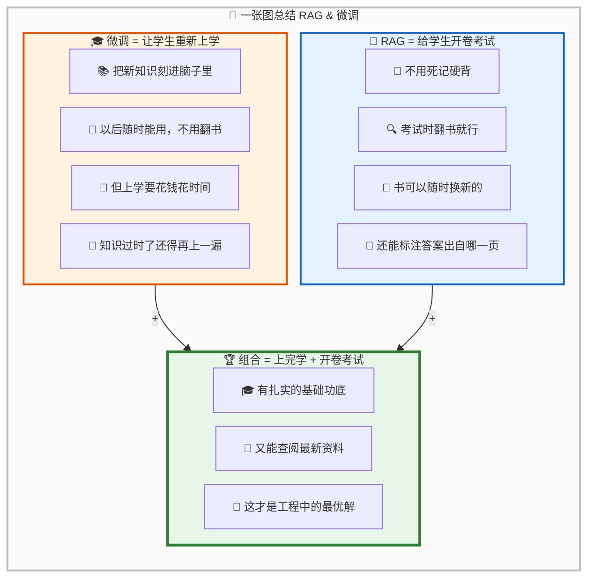

---

## 📚 参考来源

- [鹅厂面试官：什么是 RAG？工作流程是怎样的？](https://mp.weixin.qq.com/s/KnNx_ewIeJ_CZhfs6HtnTA) — 小林coding，2026-04-20
- [阿里二面：你知道 RAG 和微调有什么区别吗？](https://mp.weixin.qq.com/s/pKpIXVuFGTebA7MvmqmXxA) — 小林coding，2026-04-21

> 内容基于以上文章整理，已重新组织结构并用通俗语言改写，适合初学者阅读。
