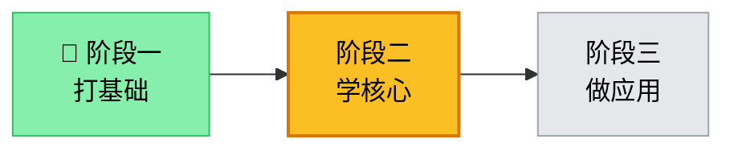
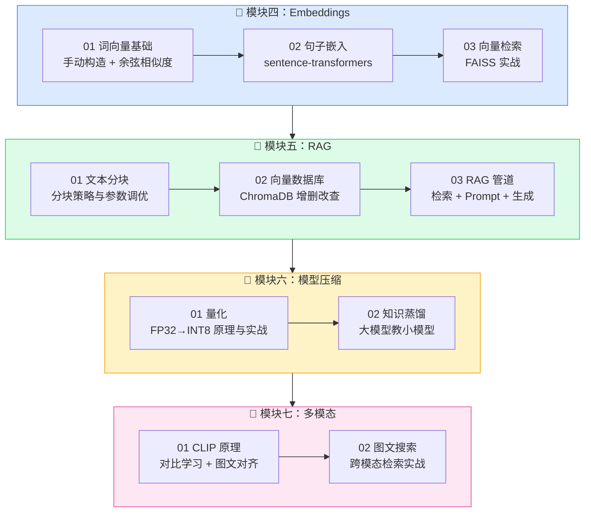
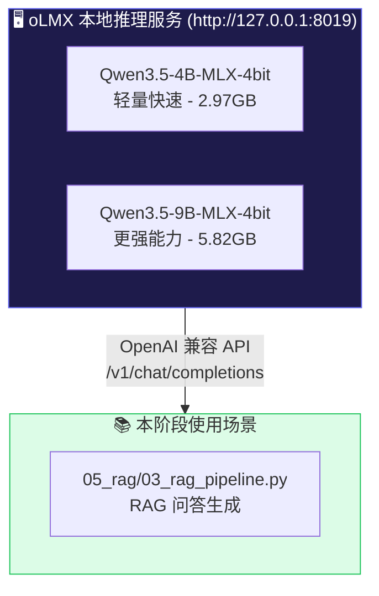
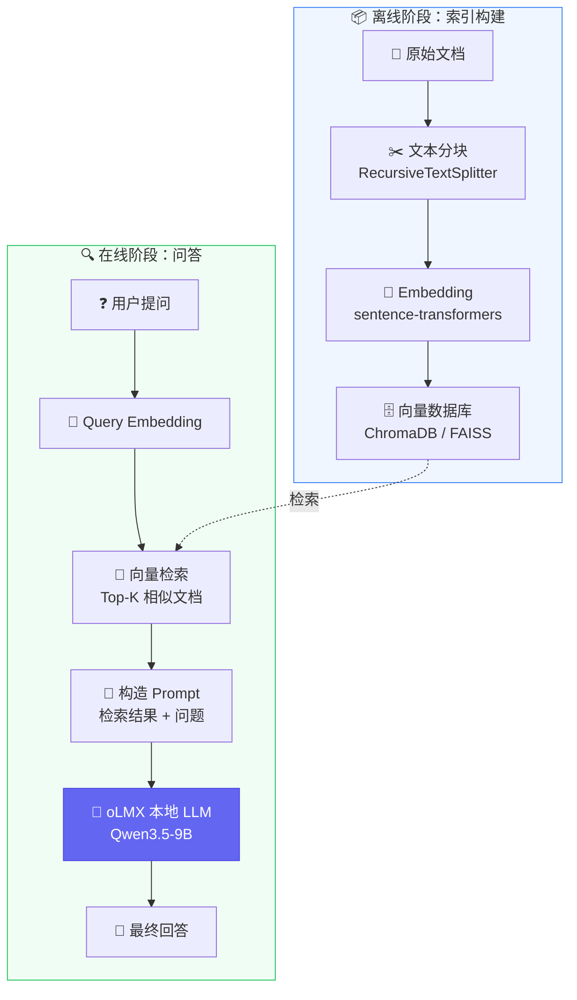
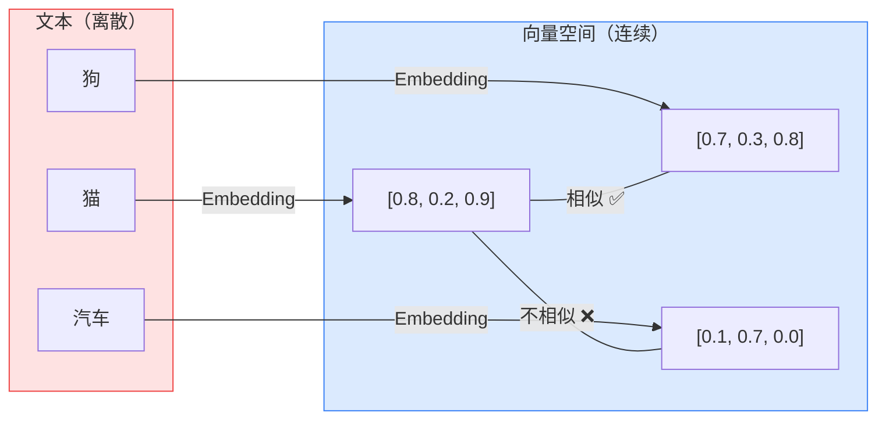
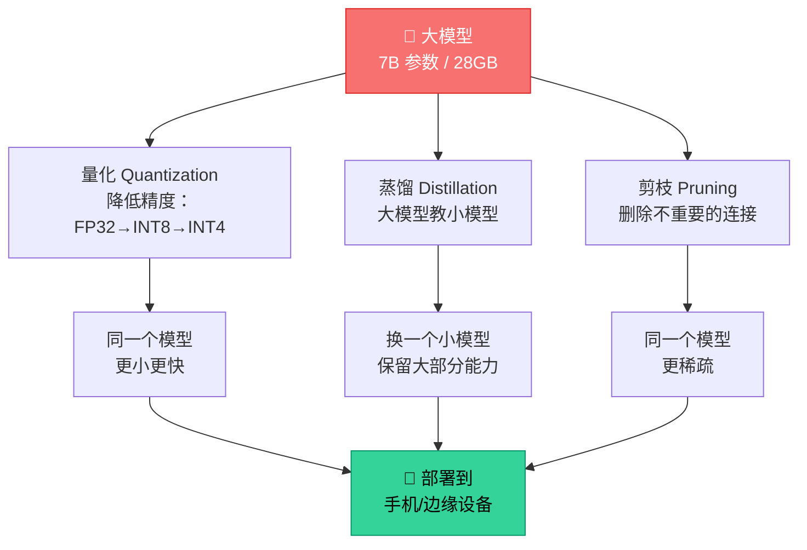
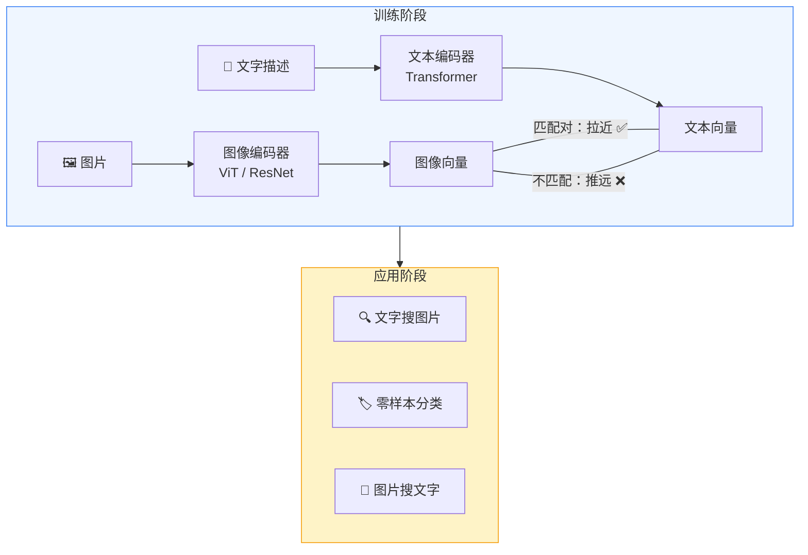
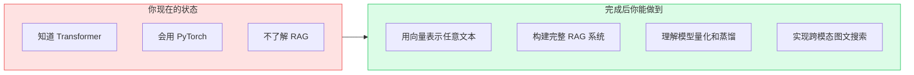

# AI 大模型学习 - 阶段二：学核心

**作者**: RJ.Wang
**邮箱**: wangrenjun@gmail.com
**创建时间**: 2026-04-22

---

## 前置条件

开始本阶段学习前，请确认你已具备以下条件：

| 类别 | 要求 | 如何验证 |
|------|------|----------|
| ✅ 阶段一 | 已完成阶段一全部练习 | 能用 PyTorch 训练 MNIST，理解 Transformer |
| 🐍 Python | 熟练使用 NumPy、函数、类 | 能独立写一个矩阵乘法并理解 shape |
| 🧠 神经网络 | 理解前向/反向传播 | 能解释 `loss.backward()` 做了什么 |
| 🤖 Transformer | 理解 Self-Attention | 能说出 Q/K/V 的含义和计算过程 |
| 💻 硬件 | Apple Silicon Mac（推荐） | oLMX 需要 M1/M2/M3/M4 芯片 |
| 🌐 网络 | 可访问 HuggingFace | 首次运行需下载预训练模型（约 100-500MB） |
| 🤖 oLMX | 已安装并运行 oLMX | 访问 `http://127.0.0.1:8019/admin` 确认 |

> ⚠️ 如果你跳过了阶段一，至少确保你理解：矩阵乘法、梯度下降、Softmax、注意力机制。否则本阶段的内容会很难跟上。

---

## 学习路线总览

本阶段在整个学习路线中的位置：



---

## 阶段二内部学习流程



---

## 本地 LLM 环境：oLMX

本阶段的 RAG 管道练习使用 [oLMX](https://github.com/jundot/omlx) 作为本地 LLM 推理后端，无需 OpenAI API Key。



**确认 oLMX 正在运行：**
```bash
# 检查服务状态
curl http://127.0.0.1:8019/v1/models -H "Authorization: Bearer your-api-key"

# 或打开管理后台
open http://127.0.0.1:8019/admin/dashboard
```

**推荐模型选择：**
| 场景 | 推荐模型 | 原因 |
|------|----------|------|
| RAG 问答 | Qwen3.5-9B | 理解能力更强，回答质量更高 |
| 快速测试 | Qwen3.5-4B | 速度快，适合调试代码 |

---

## RAG 架构全景图

这是本阶段最核心的内容 —— RAG 的完整架构：



---

## Embedding 的核心思想



---

## 模型压缩方法对比



---

## 多模态：CLIP 对比学习



---

## 项目结构

```
ai-learning-phase2/
├── 04_embeddings/                  # Embeddings 文本向量化
│   ├── 01_word_vectors.py              # 词向量基础：手动构造 + 余弦相似度
│   ├── 02_sentence_embeddings.py       # 句子嵌入：预训练模型编码文本
│   └── 03_similarity_search.py         # 向量检索：FAISS 实战
├── 05_rag/                         # RAG 检索增强生成
│   ├── 01_text_splitting.py            # 文本分块策略（含公司手册实战案例）
│   ├── 02_vector_store.py              # 向量数据库：ChromaDB 实战
│   ├── 03_rag_pipeline.py              # 完整 RAG 管道（接 oLMX）
│   └── 📖 RAG_and_Fine-tuning_学习指南.md  # 补充阅读：RAG & 微调原理详解
├── 06_model_compression/           # 模型蒸馏与压缩
│   ├── 01_quantization.py              # 量化：FP32→INT8
│   └── 02_distillation.py              # 知识蒸馏：大模型教小模型
├── 07_multimodal/                  # 多模态模型
│   ├── 01_clip_concept.py              # CLIP 原理：对比学习
│   └── 02_image_text_search.py         # 图文搜索实战
└── README.md
```

---

## 运行方式

```bash
cd ai-learning-phase2

# 运行某个练习
uv run python 04_embeddings/01_word_vectors.py
```

> 💡 首次运行 `02_sentence_embeddings.py` 和 `02_image_text_search.py` 时会自动下载预训练模型，请确保网络通畅。

---

## 每个练习的学习目标



| 模块 | 练习 | 你将学到 | 预计时间 |
|------|------|----------|----------|
| Embeddings | 01 词向量 | 为什么需要 Embedding、余弦相似度、类比推理 | 2h |
| Embeddings | 02 句子嵌入 | sentence-transformers 使用、语义搜索 | 2h |
| Embeddings | 03 向量检索 | FAISS 索引构建、暴力搜索 vs 近似搜索 | 2h |
| RAG | 01 文本分块 | chunk_size/overlap 调优、分块策略选择 | 2h |
| RAG | 02 向量数据库 | ChromaDB 增删改查、元数据过滤 | 2h |
| RAG | 03 RAG 管道 | 完整流程：分块→编码→存储→检索→生成 | 4h |
| 模型压缩 | 01 量化 | INT8 量化原理、PyTorch 动态量化 | 2h |
| 模型压缩 | 02 蒸馏 | 软标签、温度参数、对比实验 | 3h |
| 多模态 | 01 CLIP | 对比学习、零样本分类、图文对齐 | 2h |
| 多模态 | 02 图文搜索 | CLIP 模型使用、跨模态检索 | 2h |

---

## 环境变量（可选）

RAG 管道练习默认使用本地 oLMX 服务（`http://127.0.0.1:8019/v1`），无需任何 API Key 配置。

如果你想切换到 OpenAI 云端 API：
```bash
export OPENAI_API_KEY="your-key-here"
export OPENAI_BASE_URL="https://api.openai.com/v1"
```

---

## 📖 补充阅读

学完 RAG 模块后，强烈建议阅读：

**[RAG & Fine-tuning 小白学习指南](05_rag/RAG_and_Fine-tuning_学习指南.md)**

这篇指南用大量 Mermaid 图和生活比喻，深入讲解了：
- RAG 离线建库和在线问答的每一步细节
- 为什么必须 Chunking（公司手册的例子）
- Embedding 向量到底是什么（1536 维浮点数的直觉理解）
- 向量检索和 Rerank 的工作原理
- 微调 vs RAG 的选型决策树
- 两者组合使用的最佳实践

其中的 Q&A 部分来自真实学习过程中的疑问，逐层递进，非常适合巩固理解。

---

## 完成标志

当你能回答以下问题时，说明阶段二已经掌握：

- [ ] Embedding 和 One-Hot 编码有什么区别？
- [ ] 余弦相似度和欧氏距离有什么不同？
- [ ] RAG 的离线阶段和在线阶段分别做什么？
- [ ] chunk_size 设太大或太小会有什么问题？
- [ ] ChromaDB 的元数据过滤有什么用？
- [ ] INT8 量化能把模型压缩多少倍？
- [ ] 知识蒸馏中温度参数的作用是什么？
- [ ] CLIP 是如何实现图文对齐的？

全部打勾后，进入 **阶段三：做应用（LangChain + Agent）** 🚀
