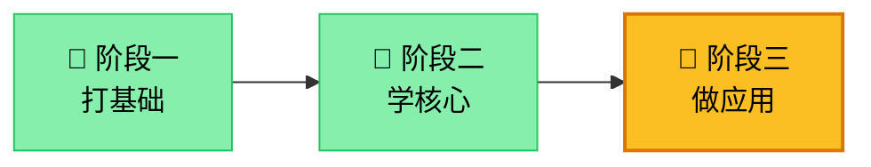
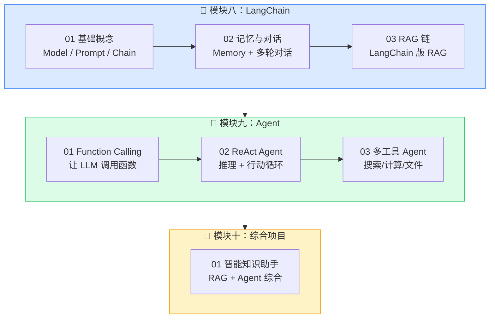
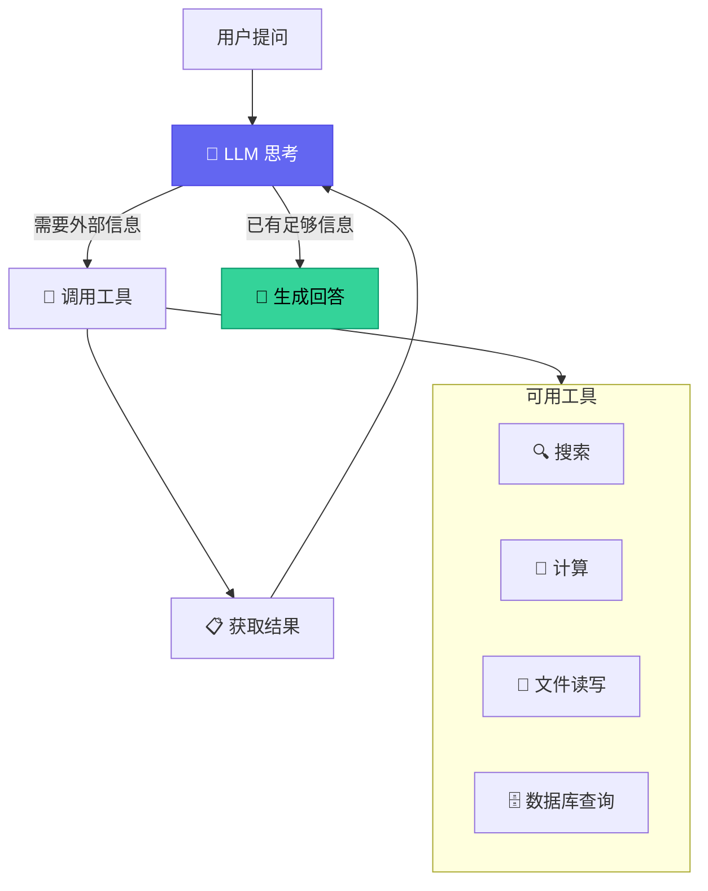
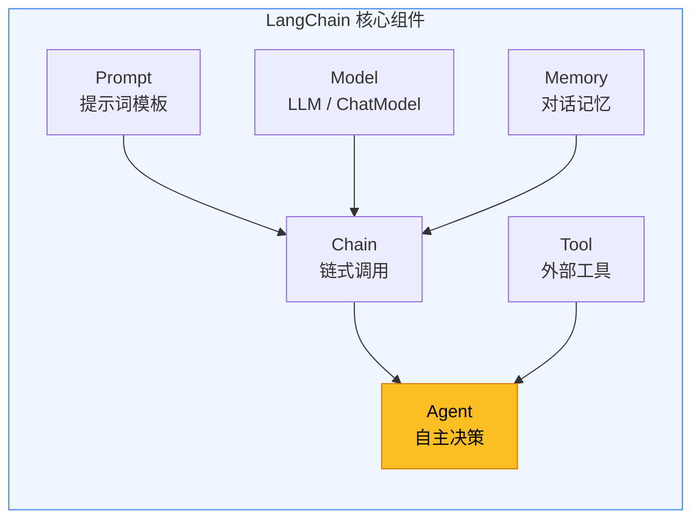

# AI 大模型学习 - 阶段三：做应用

**作者**: RJ.Wang
**邮箱**: wangrenjun@gmail.com
**创建时间**: 2026-04-22

---

## 前置条件

| 类别 | 要求 | 如何验证 |
|------|------|----------|
| ✅ 阶段一 | 已完成 Python/神经网络/Transformer | 能解释 Self-Attention |
| ✅ 阶段二 | 已完成 Embedding/RAG/模型压缩 | 能独立搭建 RAG 管道 |
| 🤖 oLMX | 已安装并运行 | 访问 `http://127.0.0.1:8019/admin` 确认 |
| 🌐 网络 | 可访问 HuggingFace | 首次运行需下载模型 |

---

## 学习路线总览



---

## 阶段三内部学习流程



---

## Agent 核心架构



---

## LangChain 核心概念



---

## 项目结构

```
ai-learning-phase3/
├── 08_langchain/                   # LangChain 框架
│   ├── 01_basics.py                    # 基础：Model + Prompt + Chain
│   ├── 02_memory.py                    # 记忆：多轮对话
│   └── 03_rag_chain.py                 # LangChain 版 RAG
├── 09_agent/                       # Agent 智能体
│   ├── 01_function_calling.py          # Function Calling 基础
│   ├── 02_react_agent.py              # ReAct 推理行动循环
│   └── 03_multi_tool_agent.py          # 多工具 Agent
├── 10_project/                     # 综合项目
│   └── 01_knowledge_assistant.py       # 智能知识助手
└── README.md
```

---

## 运行方式

**方式一：Jupyter Notebook（推荐）**
```bash
cd ai-learning-phase3
uv run jupyter notebook
```

**方式二：命令行**
```bash
cd ai-learning-phase3
uv run python 08_langchain/01_basics.py
```

所有练习默认使用本地 oLMX（`http://127.0.0.1:8019/v1`），无需云端 API Key。

---

## 每个练习的学习目标

| 模块 | 练习 | 你将学到 | 预计时间 |
|------|------|----------|----------|
| LangChain | 01 基础 | ChatModel、PromptTemplate、LCEL 链式语法 | 2h |
| LangChain | 02 记忆 | ConversationBufferMemory、多轮对话 | 2h |
| LangChain | 03 RAG 链 | 用 LangChain 重构阶段二的 RAG 管道 | 3h |
| Agent | 01 Function Calling | OpenAI 格式的函数调用、工具定义 | 2h |
| Agent | 02 ReAct | 思考→行动→观察循环、LangChain Agent | 3h |
| Agent | 03 多工具 | 组合多个工具、Agent 自主选择 | 3h |
| 综合项目 | 01 知识助手 | RAG + Agent + Memory 全部整合 | 4h |

---

## 完成标志

- [ ] 能用 LCEL 语法写 `prompt | model | parser` 链
- [ ] 理解 Memory 如何让 LLM 记住上下文
- [ ] 能定义 Tool 并让 LLM 自主调用
- [ ] 理解 ReAct 的"思考→行动→观察"循环
- [ ] 能独立搭建一个 RAG + Agent 的智能助手

全部打勾，恭喜你完成了整个学习路线！🎉
